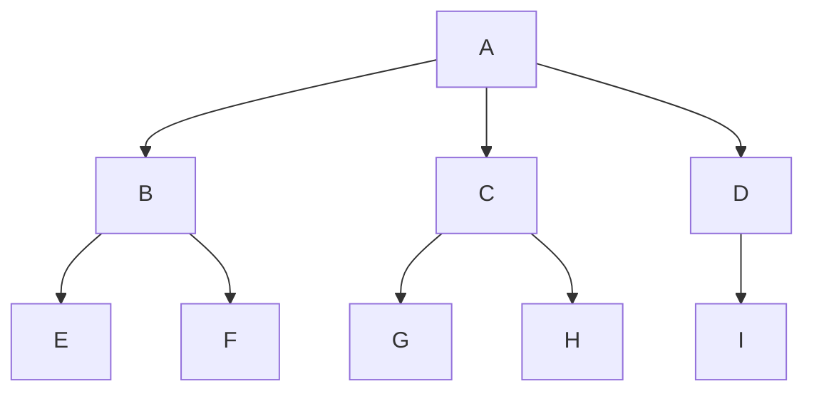
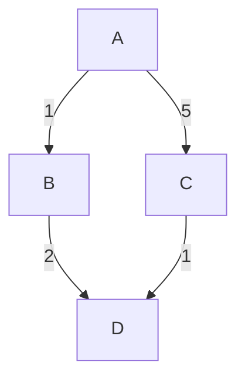
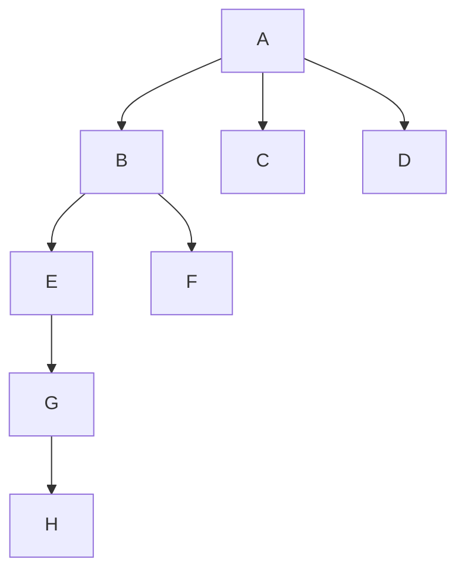
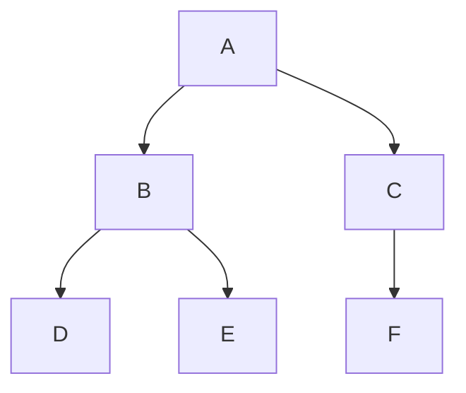

## Core Idea

When an agent cannot immediately determine the correct action, it may need to **look ahead** and evaluate sequences of future actions before acting.

This type of agent is called a **problem-solving agent**, and the computational process it uses is called **search**.

Instead of reacting instantly to the current environment, the agent internally simulates possible future paths until it discovers a sequence of actions that reaches the goal.

> [!insight] Chapter Insight  
> Chapter 3 introduces one of the foundational ideas in artificial intelligence: intelligent behavior often requires searching through possible future states before acting. Rather than reacting reflexively, problem-solving agents internally model environments, simulate future action sequences, evaluate costs, and select pathways that maximize goal achievement. The chapter formalizes concepts such as state spaces, abstraction, search problems, and path optimization, while also revealing the computational challenges created by combinatorial explosion. This framework becomes deeply important for understanding planning, reinforcement learning, robotics, optimization, and probabilistic cognition.

---
Refer: [[Lecture 3 - Game Playing]], [[MIT 6.034 Lecture 4 - Search - Hill Climbing, Depth - First, Beam]] 
# 3.1 Problem-Solving Agents

A problem-solving agent operates in environments where:

- the environment is fully observable,
    
- deterministic,
    
- static,
    
- discrete,
    
- known,
    
- and usually involves a single agent.
    

The agent uses an **atomic representation** of the world.

In atomic representations, each state is treated as a complete indivisible unit with no visible internal structure.

Example:

![[Pasted image 20260621115112.png|520]]

Instead of modeling every detail of a city (traffic, weather, road quality, passengers, emotions), the state may simply be represented as:

> "Agent is in Arad."

The internal details are abstracted away because they are unnecessary for solving the route-finding problem.

This is one of the first major simplifications used throughout AI. Real-world environments are overwhelmingly complex, so intelligent systems must compress reality into manageable representations before reasoning becomes computationally feasible.

## Problem-Solving Process

The book defines four major stages of problem solving.

### 1. Goal Formulation

The agent first decides what it wants to achieve.

Example:

> Reach Bucharest.

Goals restrict the number of actions the agent must consider.

Without goals, every possible action becomes equally relevant.

A goal therefore acts as a filtering mechanism for intelligence. Rational behavior depends heavily on restricting search toward meaningful future states instead of evaluating every possible action equally.

---

### 2. Problem Formulation

The agent creates an abstract model of the world.

This includes:

- possible states,
    
- actions,
    
- transitions,
    
- and goals.
    

For the Romania example:

- states = cities,
    
- actions = travel between connected cities,
    
- transition = moving from one city to another.
    

Only the information relevant to reaching Bucharest is included.

Everything else is ignored.

This process of removing unnecessary detail is called **abstraction**.

## Abstraction

Abstraction means simplifying reality into a manageable representation.

A useful abstraction:

- removes irrelevant information,
    
- preserves validity,
    
- and keeps actions computationally tractable.
    

The book emphasizes that intelligent systems would become overwhelmed without abstraction.

Example:

Instead of representing driving as:

- moving steering wheel 1 degree,
    
- moving foot 1 centimeter,
    
- checking mirrors continuously,
    

the abstraction becomes:

> "Drive from Arad to Sibiu."

This is one of the most important conceptual tools in AI because raw reality contains too many variables for exhaustive computation. Abstraction allows reasoning to occur at higher conceptual levels while preserving enough structure to solve the problem.

> [!note]+ Important Computational Insight  
> Abstraction is fundamentally a strategy for controlling combinatorial explosion. Without abstraction, state spaces become computationally impossible to search because the number of possible states grows exponentially with environmental complexity.


---

### 3. Search

The agent simulates action sequences internally before acting.

> [!lecture]+ MIT AI Lecture 4 Connection
> Prof. Winston emphasizes that search is fundamentally about
> **making choices** rather than navigating maps.
>
> Maps are merely a visual illustration.
>
> Search is a general framework for exploring alternatives whenever
> an agent must choose among multiple possible future actions.
>
> [[MIT 6.034 Lecture 4 - Search - Hill Climbing, Depth - First, Beam]]

It explores paths through the state space until it finds a sequence that reaches the goal.

A successful sequence is called a **solution**.

Example:

> Arad → Sibiu → Fagaras → Bucharest

The agent may test many unsuccessful sequences before discovering a valid solution.

This introduces one of the central ideas of AI:

> intelligence often involves internal future simulation before physical action occurs.

Search therefore becomes a computational model of deliberation.

---

### 4. Execution

Once the solution is found, the agent executes the actions one by one in the real world.

Execution transforms internal planning into real-world behavior.

---

# Open-Loop vs Closed-Loop Systems

In fully observable deterministic environments, the solution can be executed without continuously checking the environment.

This is called an **open-loop system**.

The agent can essentially "close its eyes" because the model guarantees the outcome if the environment behaves predictably.

In uncertain or partially observable environments, the agent must continuously monitor reality while acting.

This is called a **closed-loop system**.

Closed-loop systems repeatedly update actions based on changing environmental feedback.


# 3.1.1 Search Problems and Solutions

A search problem formally consists of:

## State Space

The set of all possible states the environment can occupy.

Example:

All cities reachable in the Romania map.

The state space defines the universe of possibilities through which the agent may search.

> [!note]+ Winston's Interpretation
> Search trees are not the same thing as state spaces.
>
> A state space describes possible world states.
>
> A search tree describes the choices generated while exploring those states.
>
> [[MIT 6.034 Lecture 4 - Search - Hill Climbing, Depth - First, Beam]]

## Initial State

The starting condition of the agent.

Example:

> Arad

## Goal State(s)

The desired destination or condition.

Example:

> Bucharest

Sometimes goals are not a single state but a property.

Example:

> "All rooms are clean."

## Actions

The set of legal operations available in each state.

Example:

ACTIONS(Arad) =

- ToSibiu
    
- ToTimisoara
    
- ToZerind
    

## Transition Model

Defines the result of applying an action.

Example:

RESULT(Arad, To Zerind) = Zerind

The transition model formally describes how actions transform the world.

## Action Cost Function

Every action may have a cost.

Costs may represent:

- distance,
    
- time,
    
- fuel,
    
- money,
    
- risk,
    
- energy.
    

The total path cost is the sum of all action costs.

An **optimal solution** is the path with the lowest total cost.

Optimization becomes central because many valid solutions may exist, but some are substantially more efficient or desirable than others.

---

# Graph Representation

Search problems are commonly represented as graphs.

- vertices = states,
    
- edges = actions.
    

The Romania map is treated as a graph where roads connect cities.

This becomes foundational for later search algorithms such as:

- Breadth-First Search,
    
- Uniform Cost Search,
    
- A* Search.
    

Graph representations are extremely important because they allow complex reasoning problems to be transformed into mathematically analyzable structures.

---

# 3.1.2 Formulating Problems

The text emphasizes that all problem formulations are simplified models of reality.

The actual world contains enormous complexity.

The purpose of abstraction is not to perfectly reproduce reality but to preserve enough structure to solve the relevant problem efficiently.

A good abstraction:

- preserves validity,
    
- removes irrelevant complexity,
    
- and keeps computation manageable.
    

This highlights a fundamental tradeoff in AI:

> more realistic representations often become computationally intractable.


# 3.2 Example Problems

The chapter introduces both standardized and real-world search problems.

These environments help researchers analyze the strengths and weaknesses of different search strategies under controlled conditions.

---

# Standardized Problems

Standardized problems are simplified benchmark environments used to study search algorithms.

## Grid World

A rectangular environment divided into cells.

Agents move between cells while interacting with objects and obstacles.

The vacuum world is represented as a grid world.

![[Pasted image 20260621201054.png|410]]
The formulation includes:

- states,
    
- actions,
    
- transitions,
    
- goals,
    
- and action costs.
    

Grid worlds remain foundational in reinforcement learning and robotics because they provide controlled environments for studying planning and learning behavior.

## Sokoban Puzzle

The agent pushes boxes to target locations.

The problem becomes computationally difficult because the number of possible states grows enormously.

This demonstrates combinatorial explosion in search spaces.

Even seemingly simple environments can produce astronomically large numbers of possible action sequences.

## Sliding-Tile Puzzle

Examples:

- 8-puzzle,
    
- 15-puzzle.
    

Tiles slide into blank spaces until the goal arrangement is reached.

The chapter emphasizes how even simple physical systems can generate massive search spaces.

This becomes a classic demonstration of why intelligent heuristics are necessary.

## Infinite State Spaces

The Knuth number problem demonstrates that some search spaces are infinite.

Using operations such as:

- square root,
    
- floor,
    
- factorial,
    

the agent searches through endlessly expanding mathematical states.

This introduces the idea that search may occur over infinite possibility spaces.

# Real-World Search Problems

The chapter then discusses real-world applications of search.

Unlike simplified toy environments, real-world problems often involve uncertainty, dynamic conditions, and massive state spaces.

## Route Finding

Classic navigation problems.

Modern systems extend this with:

- traffic prediction,
    
- rerouting,
    
- uncertainty handling.
    

Modern navigation systems therefore combine search with probabilistic forecasting.

## Airline Planning

States must include:

- location,
    
- time,
    
- historical constraints,
    
- ticket structures,
    
- transfer windows.
    

This demonstrates that real-world state spaces become much richer than simple location graphs.

## Traveling Salesperson Problem (TSP)

The goal is to visit all cities with minimum cost.

This is one of the most famous optimization problems in computer science.

Applications include:

- logistics,
    
- delivery routing,
    
- manufacturing,
    
- transportation systems.
    

TSP is historically important because it demonstrates how optimization problems become computationally explosive as scale increases.

## Robot Navigation

Robots operate in continuous multidimensional spaces.

Real-world robotics introduces:

- uncertainty,
    
- sensor error,
    
- dynamic environments,
    
- partial observability.
    

This moves beyond simple deterministic search.

## Protein Design

The search space consists of possible amino acid sequences.

The goal is to discover proteins that fold into useful biological structures.

This is an example of search in extremely high-dimensional biological spaces.

Protein folding and molecular design have become major modern AI applications.

---

# Important Conceptual Shift in This Chapter

Chapter 2 focused on:

> "How agents choose actions."

Chapter 3 shifts toward:

> "How agents search through future possibilities before acting."

This is a major conceptual transition in AI.

Decision-making is no longer purely reactive.

Instead, intelligence increasingly depends on:

- prediction,
    
- future-state simulation,
    
- probabilistic path evaluation,
    
- and computational search through possibility spaces.
    

This shift lays the foundation for planning systems, optimization algorithms, reinforcement learning, robotics, and modern autonomous agents.


# 3.3 Search Algorithms

## Core Idea

A **search algorithm** takes a search problem as input and returns either:

- a solution, or
    
- failure.
    

Search algorithms build a **search tree** over a **state-space graph**.

- **State-space graph** → describes all possible states and transitions/actions between them.
    
- **Search tree** → describes the paths explored from the initial state toward the goal.
    

The central idea behind search is that intelligent systems often cannot know the correct action immediately. Instead, they must internally explore future possibilities before acting.

This becomes one of the foundational computational models of intelligence in AI.

> [!abstract]+ Beginner Intuition  
> Search algorithms are essentially systematic methods for answering:
> 
> > “If I take this action now, what future states might happen next?”
> 
> The agent explores possible futures until it discovers a path leading to the goal.


# State Space vs Search Tree

## State Space

The state space describes:

- the set of possible states in the world
    
- the actions that allow transitions between states
    

The state space may be finite or infinite.

Example:

In the Romania route-finding problem:

- each city = state
    
- roads = actions/transitions
    

The entire map forms the state-space graph.

## Search Tree

The search tree represents:

- paths from the initial state
    
- exploration toward a goal state
    

Important properties:

- Multiple paths may reach the same state.
    
- Therefore, multiple nodes in the search tree may correspond to the same state.
    
- Each node in the tree still has one unique path back to the root.
    

> The root node corresponds to the initial state of the problem.

The search tree therefore represents not just states, but _possible histories_ of actions.

## Beginner Visualization

Imagine standing in a maze.

The **state space** is:

> the full maze layout.

The **search tree** is:

> the paths you personally try while exploring.

This distinction is extremely important.

> [!note]+ Important Distinction  
> A single state may appear many times in a search tree because there may be many different ways to arrive at that state.

---

# Search Tree vs State Space (VERY IMPORTANT)

## State Space

The actual world structure.

Example:

```text
Cities connected by roads
```

## Search Tree

The exploration history generated by the algorithm.

The same state may appear multiple times through different paths.

## Example

````markdown
graph TD
    A --> B
    A --> C
    B --> D
    C --> D
```
````

State:

```text
D
```

appears through two different paths.

In the search tree:

- these become separate nodes,
    
- even though they represent the same world state.

---

> [!warning] Common Mistake  
> Search trees are NOT identical to state-space graphs.
> 
> Search trees represent:
> 
> ```text
> explored paths
> ```
> 
> while state spaces represent:
> 
> ```text
> actual environment structure
> ```

---

# Expanding Nodes

To expand a node:

1. Consider the available `ACTIONS(state)`
    
2. Apply `RESULT(state, action)`
    
3. Generate child/successor nodes
    

This is the basic mechanism through which search progresses.

## Terminology

|Term|Meaning|
|---|---|
|Parent node|Node from which another node was generated|
|Child node|Newly generated node|
|Successor node|Another term for child node|
|Expand|Generate successor nodes|

## Beginner Example

Suppose the agent is in:

> Arad

Possible actions:

- Go to Sibiu
    
- Go to Zerind
    
- Go to Timisoara
    

Expanding the Arad node generates three child nodes representing those future possibilities.

# Frontier and Reached States

## Frontier

The **frontier** is:

- the set of generated but unexpanded nodes
    

The frontier separates:

|Region|Meaning|
|---|---|
|Interior region|States already expanded|
|Exterior region|States not yet reached|

The frontier is extremely important because it represents:

> “What future possibilities are currently under consideration?”

## Reached State

A state is considered **reached** once a node for it has been generated, regardless of whether it has been expanded.

## Beginner Intuition

Think of the frontier like:

> bookmarks of future possibilities waiting to be explored.

# BEST-FIRST-SEARCH

## Core Principle

Best-first search selects:

```text
f(n)=evaluation score of node n
```

and expands the node with the minimum value.

Different definitions of:

```text
f(n)
```

produce different search algorithms.

This is one of the most important unifying ideas in search theory.

## BEST-FIRST-SEARCH Algorithm

```text
function BEST-FIRST-SEARCH(problem, f) returns solution or failure

node ← NODE(STATE = problem.INITIAL)

frontier ← priority queue ordered by f
reached ← lookup table containing initial state

while frontier is not empty do

    node ← POP(frontier)

    if node.STATE is goal then
        return node

    for each child in EXPAND(problem, node) do

        s ← child.STATE

        if s not in reached
           OR child.PATH-COST < reached[s].PATH-COST then

              reached[s] ← child
              add child to frontier

return failure
```

## EXPAND Function

```text
function EXPAND(problem, node)

for each action in ACTIONS(node.STATE)

    s' ← RESULT(node.STATE, action)

    cost ← node.PATH-COST
            + ACTION-COST(node.STATE, action, s')

    yield new node
```

# 3.3.1 Best-First Search

## Evaluation Function

Best-first search chooses the frontier node with minimum:

```text
f(n)
```

This evaluation function determines search behavior.

## Important Property

If a better path to an already reached state is found:

- the node is re-added to the frontier
    
- the stored path is replaced
    

This ensures the algorithm always keeps the best known path.

## Key Insight

Different definitions of:

```text
f(n)
```

create different algorithms:

|Algorithm|Evaluation Function|
|---|---|
|Breadth-first search|Depth|
|Uniform-cost search|Path cost|
|Depth-first search|Negative depth|

This is an extremely important conceptual unification.

Many famous search algorithms are simply different choices of evaluation function.

## Beginner Analogy

Imagine choosing which road to explore next:

- BFS → choose nearest unexplored road
    
- DFS → choose deepest unexplored road
    
- Uniform-cost → choose cheapest road so far
    

# 3.4 Uninformed Search Strategies

## Core Idea

Uninformed search algorithms:

- have no knowledge of closeness to the goal
    

Example:

- agent in Arad does not know whether Sibiu or Zerind is better
    

These algorithms search blindly using only structural rules.

# 3.4.1 Breadth-First Search (BFS)

## Beginner Intuition

Breadth-First Search explores the search space level by level.

It first explores all nearby possibilities before moving deeper.

Think of throwing a stone into water:

- the ripple expands outward evenly in all directions.
    

BFS behaves similarly.

It explores:

1. all states 1 step away,
    
2. then all states 2 steps away,
    
3. then all states 3 steps away,
    
4. and so on.
    

## Core Principle

Breadth-first search expands:

1. root
    
2. all depth-1 nodes
    
3. all depth-2 nodes
    
4. etc.
    

It explores level-by-level.

## BFS as Best-First Search

Breadth-first search can be implemented using:

```text
f(n)=depth(n)
```

## Queue Type [[Queues]]

BFS uses:

- FIFO queue
    

Reason:

- shallower nodes are expanded before deeper nodes
    

## BFS Queue Intuition

Example:

```text
Start = A
```

After expanding A:

```text
Queue = [B, C, D]
```

Expand B first:

```text
Queue = [C, D, E, F]
```

Then expand C:

```text
Queue = [D, E, F, G]
```

The queue preserves exploration order.
## BFS Diagram

````markdown

````

BFS exploration order:

```text
A
B C D
E F G H I
```

## Beginner Visualization

BFS spreads outward like:

> ripples in water.

It explores all nearby possibilities before going deeper.

## Why BFS Finds Shortest Paths

BFS guarantees the shortest path when:

- all edge costs are equal.
    

Why?

Because BFS reaches shallow solutions first.

If every step costs the same, then:

```text
minimum depth = minimum cost
```

# BFS Properties

## Completeness

BFS is complete.

## Cost Optimality

BFS is optimal only when:

- all actions have equal cost
    

# BFS Complexity

If:

- branching factor = b
    
- solution depth = d

Refer: [[Branching Factor]]

Then:

$$
1 + b + b^2 + \cdots + b^d = O(b^d)
$$

## Time Complexity

```text
O(b^d)
```

## Space Complexity

```text
O(b^d)
```

## BFS Strengths

### Advantages

- Complete
    
- Guaranteed shortest path (equal costs)
    
- Systematic
    
- Easy to understand
    

### Weaknesses

- Extremely high memory usage
    
- Explodes exponentially at large depths


## BFS Memory Problem

BFS stores all frontier nodes simultaneously.

If branching factor is:

```text
b = 10
```

then depth growth becomes:

```text
10
100
1000
10000
...
```

This is why BFS quickly becomes impractical for deep searches.

## Important Observation

Breadth-first search has severe memory requirements.

Example from text:

|Depth|Consequence|
|---|---|
|d = 10|~10 terabytes memory|
|d = 14|~3.5 years runtime|


> [!note] Important Concept  
> BFS is often preferred when:
> 
> - solution depth is small,
>     
> - shortest path matters,
>     
> - and memory is available.
>     
# 3.4.2 Uniform-Cost Search (Dijkstra's Algorithm)

## Beginner Intuition

Uniform-Cost Search expands the:

```text
lowest total path-cost node first
```

Unlike BFS:

- it does NOT care about depth,
    
- it cares about cumulative cost.


## Core Principle

Uniform-cost search expands:

- lowest path-cost node first
    

Evaluation function:

```text
f(n)=g(n)
```

where:

```text
g(n)=PATH-COST
```

---

# Key Difference from BFS

|BFS|Uniform-Cost|
|---|---|
|Expands by depth|Expands by cumulative cost|


## Example

Suppose:

```text
Path A = 2 steps, cost 100
Path B = 5 steps, cost 20
```

BFS chooses:

```text
Path A
```

because it is shallower.

Uniform-Cost Search chooses:

```text
Path B
```

because total cost is lower.

## Real-Life Analogy

Google Maps rarely chooses:

```text
fewest roads
```

Instead it chooses:

```text
minimum travel time
```

That resembles Uniform-Cost Search.

## UCS Diagram

````markdown

````

Possible paths:

```text
A → B → D = cost 3
A → C → D = cost 6
```

UCS correctly selects:

```text
A → B → D
```

## Important Property

Uniform-cost search checks goals only when:

- expanding a node
    

NOT when generating it.

This prevents premature acceptance of higher-cost solutions.

## Example from Text

Two routes to Bucharest:

|Path|Cost|
|---|---|
|Through Fagaras|310|
|Through Pitesti|278|

Uniform-cost search correctly returns the cheaper path.

## Properties

### Complete

Yes, if action costs are positive.

### Cost Optimal

Yes.

## Beginner Intuition

Uniform-cost search behaves like:

> “Always continue with the cheapest journey discovered so far.”

# 3.4.3 Depth-First Search (DFS)

## Beginner Intuition

DFS explores one path deeply before trying alternatives.

Imagine exploring a cave system:

- you keep walking down one tunnel,
    
- only backtracking when you hit a dead end.
    

That is DFS behavior.

## Core Principle

Depth-first search expands:

- deepest frontier node first
    

Equivalent evaluation function:

```text
f(n) = - depth(n)
```

## Typical Implementation

Usually implemented as:

- tree-like search
    
- without reached table
    

# Search Behavior

DFS:

1. follows one path deeply
    
2. backtracks after dead ends
    

## DFS Diagram

````markdown

````

DFS exploration path:

```text
A → B → E → G → H
```

Only after reaching dead ends does it return upward.

## DFS Backtracking

Backtracking is critical.

Example:

```text
A → B → E → dead end
```

DFS returns to:

```text
B
```

Then explores another branch.

# Properties

## Not Cost Optimal

Returns first solution found.

## Complete?

|State Space|Complete?|
|---|---|
|Finite trees|Yes|
|Infinite/cyclic spaces|No|


## Major Problem

DFS can get trapped:

- in infinite paths
    
- in cycles
    

## Major Advantage

Very low memory usage.

## DFS Strengths

### Advantages

- Very low memory usage
    
- Can find deep solutions quickly
    
- Simple implementation
    

### Weaknesses

- Not guaranteed shortest path
    
- Can get trapped in infinite paths
    
- Can endlessly loop in cyclic graphs
    

## Why DFS Uses Little Memory

DFS stores mostly:

- the current path,
    
- plus a few unexplored siblings.
    

Memory grows approximately linearly with depth.

# DFS Complexity

## Space Complexity

```text
O(bm)
```

where:

- b = branching factor
    
- m = maximum depth
    

## Important Insight

DFS frontier behaves like:

- a radius
    

while BFS frontier behaves like:

- an expanding sphere surface
    

## Beginner Visualization

DFS is like:

> exploring one cave tunnel completely before trying another.

---

> [!warning] Major DFS Limitation  
> In infinite state spaces:
> 
> DFS may never return.
> 
> It can endlessly follow one infinite branch while ignoring other possible solutions.

# Backtracking Search

A memory-efficient DFS variant.

## Key Features

- generates one successor at a time
    
- modifies current state directly
    
- stores only:
    
    - current state
        
    - path of actions
        

## Complexity

Memory:

```text
O(m)
```


# 3.4.4 Depth-Limited and Iterative Deepening Search

# Depth-Limited Search

## Core Idea

DFS with maximum depth limit:

```text
ℓ
```

Nodes deeper than:

```text
ℓ
```

are treated as having no successors.

# Iterative Deepening Search (IDS)

## Beginner Intuition

IDS repeatedly performs DFS with increasing depth limits.

It searches:

```text
depth 0
depth 1
depth 2
depth 3
...
```

until the goal is found.

## Why IDS Exists

BFS:

- good completeness,
    
- terrible memory.
    

DFS:

- excellent memory,
    
- poor reliability.
    

IDS combines both.

## Core Principle

Repeatedly run depth-limited search with limits:

```text
0, 1, 2, 3, ...
```

until solution found.

## IDS Diagram

````markdown

````

IDS repeatedly explores:

```text
A
A B C
A B D E C F
```

## Key Advantage

Combines:

|DFS Advantage|BFS Advantage|
|---|---|
|Low memory|Completeness/optimality|


## Why Repetition is Acceptable

At first glance IDS seems wasteful because upper nodes repeat.

However:

- most nodes in trees exist near the bottom,
    
- repeated shallow exploration is relatively cheap.


# IDS Properties

## Complete

Yes (under stated conditions).

## Optimal

Yes when action costs are equal.

# Complexity

## Time

```text
O(b^d)
```

## Space

```text
O(bd)
```

or

```text
O(bm)
```

depending on problem conditions.

## Important Insight

IDS repeats upper-level nodes many times.

However:

- most nodes are near bottom levels
    
- repetition cost is usually acceptable
    

## Preferred Use Case

Iterative deepening is preferred when:

- state space is too large for memory
    
- solution depth is unknown
    

> [!important] Why IDS Is Important  
> IDS is one of the most practically useful uninformed search algorithms because it balances:
> 
> - low memory,
>     
> - completeness,
>     
> - and near-optimal performance.
>     


# Summary of Major Algorithms

|Algorithm|Main Idea|Strength|Weakness|
|---|---|---|---|
|BFS|Explore level-by-level|Complete + optimal (equal cost)|Huge memory usage|
|DFS|Explore deepest path first|Very low memory|Can get stuck|
|Uniform-Cost|Explore cheapest path first|Cost optimal|Can be slow|
|IDS|Repeated depth-limited DFS|Low memory + complete|Repeats work|

# Important Big-Picture Insight

This section introduces one of the deepest ideas in AI:

> intelligence often requires internal simulation of future possibilities before acting.

Search algorithms therefore become computational models of:

- planning,
    
- reasoning,
    
- deliberation,
    
- prediction,
    
- and future-state evaluation.
    

---

# 3.4.5 Bidirectional Search

# Definition

> [!info] Bidirectional Search
> **Bidirectional Search** is a search strategy that simultaneously performs:
>
> - **Forward search** from the **initial state**, and
> - **Backward search** from the **goal state(s)**,
>
> with the expectation that the two searches will eventually meet.

Unlike previous search algorithms that only expand outward from the start state, bidirectional search explores the problem from **both ends at the same time**.

# Motivation

The book explains the motivation using the branching factor.

Suppose

- branching factor = **b**
- solution depth = **d**

A normal search expands approximately

$$
b^d
$$

nodes.

Instead, if we search from both directions, each search only needs to travel approximately halfway.

Each search expands

$$
b^{d/2}
$$

nodes.

Therefore the total work becomes

$$
b^{d/2}+b^{d/2}
$$

instead of

$$
b^d
$$


## Why is this a huge improvement?

The textbook gives the example

$$
b=10,\qquad d=10
$$

Normal search:

$$
10^{10}
=
10,000,000,000
$$

Bidirectional search:

$$
2\times10^5
=
200,000
$$

This is roughly

**50,000 times fewer nodes.**


> [!important] Key Idea
> Instead of exploring one enormous tree,
> two much smaller trees are grown until they meet in the middle.


# Basic Idea

Instead of

```
Start
   ↓
   ↓
   ↓
 Goal
```

Bidirectional search performs

```
Start
   ↓
   ↓

Meeting Point

   ↑
   ↑
 Goal
```

Once both searches reach the same state,

the solution path can be constructed.

---

# Requirements

The textbook notes that bidirectional search is more complicated than ordinary search.

It requires maintaining:

- two frontiers
- two reached tables

and it must also be able to perform **backward reasoning**.


## Forward Search

Starts from

- initial state

and generates successors normally.

## Backward Search

Starts from

- goal state

and moves backwards.

The algorithm must know:

> If

$$
s'
$$

is a successor of

$$
s
$$

in the forward direction,

then

$$
s
$$

must be considered a successor of

$$
s'
$$

during backward search.

> [!warning] Requirement
> Bidirectional search only works when backward transitions can be generated.


# Meeting of Frontiers

The search finishes when

one search reaches a state that has already been reached by the search coming from the opposite direction.

The two partial paths are then joined together.

```
Start

↓

↓

A

↓

↓

B

↑

↑

Goal
```

When both searches reach **B**, the solution becomes

```
Start

↓

↓

B

↓

↓

Goal
```


# Bidirectional Best-First Search

The textbook focuses on a version called

## Bidirectional Best-First Search

Although there are

- two frontiers

the algorithm always expands the node having the **lowest evaluation function** across **both frontiers**.

It does **not** alternate strictly between forward and backward searches.

---

> [!note]
> At every iteration,
> whichever frontier currently contains the smallest evaluation value gets expanded.

---

# Figure 3.14 — Algorithm Overview

The function is

```text
BIBF-SEARCH(problemF, fF,
            problemB, fB)
```

where

- `problemF` = forward problem
- `problemB` = backward problem
- `fF` = forward evaluation function
- `fB` = backward evaluation function

---

# Step 1 — Create Initial Nodes

```text
nodeF ← NODE(problemF.INITIAL)
```

Creates the starting node.

---

```text
nodeB ← NODE(problemB.INITIAL)
```

Creates the goal node for backward search.

---

# Step 2 — Initialize Forward Frontier

```text
frontierF
```

A priority queue ordered according to

$$
f_F
$$

Initially contains only

```
Start
```

---

# Step 3 — Initialize Backward Frontier

```text
frontierB
```

Another priority queue,

ordered according to

$$
f_B
$$

Initially contains only

```
Goal
```

---

# Step 4 — Reached Tables

Forward search stores

```text
reachedF
```

mapping

```
State

↓

Node
```

Backward search stores

```text
reachedB
```

These tables prevent unnecessary repeated work.

# Step 5 — Initialize Solution

Initially,

```text
solution = failure
```

No connection has yet been found.

# Main Loop

The algorithm repeatedly executes

```text
while not TERMINATED(...)
```

until it is mathematically certain that no better solution remains.

# Choosing Which Frontier to Expand

The algorithm compares

```text
fF(TOP(frontierF))
```

and

```text
fB(TOP(frontierB))
```

Whichever has the smaller value gets expanded.


## Case 1

If

Forward frontier has the smaller value

execute

```text
PROCEED(F,...)
```


## Case 2

Otherwise execute

```text
PROCEED(B,...)
```


> [!important]
> Expansion direction is chosen dynamically.
>
> The algorithm does **not** simply alternate between forward and backward searches.


# The PROCEED Function

The helper function

```text
PROCEED(...)
```

expands one node from one frontier.


## Step 1

```text
POP(frontier)
```

Remove the highest-priority node.


## Step 2

Expand it.

```text
EXPAND(problem,node)
```

Generate all successor nodes.

## Step 3

For every child,

retrieve

```text
child.STATE
```


## Step 4

Check whether

- state has never been reached

or

- a cheaper path has now been found.

If either is true,

update

```text
reached
```

and insert the child into the frontier.

# Collision Test

After every newly generated child,

the algorithm asks

> Has the opposite search already reached this state?

This is checked by looking inside

```text
reached2
```


If yes,

the algorithm calls

```text
JOIN-NODES(...)
```


# JOIN-NODES

This function combines Forward partial path with Backward partial path to produce one complete solution. Conceptually,

```
Start

↓

↓

Meeting State

↓

↓

Goal
```

becomes

```
Start

↓

↓

↓

↓

Goal
```

---

# Updating the Best Solution

The textbook emphasizes an important point.

The first solution found is **not necessarily the best**. Therefore, every new joined path is compared against the current best solution. If it is cheaper, replace the current solution.

> [!warning]
> Unlike ordinary Uniform-Cost Search,
> the first meeting of the two searches may **not** be optimal.


# TERMINATED Function

The search does **not** immediately stop after the first meeting.

Instead, the function

```text
TERMINATED(...)
```

decides whether a better solution could still exist. Only after proving no cheaper solution remains does the algorithm stop.

---

# Bidirectional Uniform-Cost Search

A particularly important special case occurs when the evaluation function is simply the path cost.

That is,

$$
f(n)=g(n)
$$

This produces

## Bidirectional Uniform-Cost Search

The textbook states:

If the optimal path cost is

$$
C^*
$$

then

**no node whose path cost exceeds**

$$
\frac{C^*}{2}
$$

needs to be expanded.

> [!important] Why This Helps
> Each search only explores approximately half of the optimal path before meeting.
>
> This greatly reduces the number of node expansions compared with ordinary Uniform-Cost Search.


# Advantages

> [!success] Advantages
> - Can dramatically reduce the search space.
> - Searches from both directions simultaneously.
> - Especially effective when branching factor is high.
> - Bidirectional Uniform-Cost Search can provide considerable speedups.
> - Uses two frontiers that meet near the middle rather than exploring an entire search tree from one side.

# 3.4.6 Comparing Uninformed Search Algorithms

# Overview

The textbook concludes the discussion of uninformed search by comparing all major algorithms introduced so far.

The comparison is based on four evaluation criteria introduced earlier in Section **3.3.4**:

1. **Completeness**
2. **Optimal Cost**
3. **Time Complexity**
4. **Space Complexity**

The comparison shown in Figure 3.15 applies to the **tree-search** versions of the algorithms, which do **not** check for repeated states.

---

> [!note]
> For **graph-search** versions (which do check repeated states), the textbook notes:
>
> - Depth-First Search becomes complete for finite state spaces.
> - Time and space become bounded by the size of the graph:
>
> $$
> |V|+|E|
> $$
>
> where:
> - \(V\) = vertices (states)
> - \(E\) = edges (transitions)

---

# Figure 3.15 — Comparison Table

| Criterion         | Breadth-First Search | Uniform-Cost Search                       | Depth-First Search | Depth-Limited Search | Iterative Deepening | Bidirectional Search* |
| ----------------- | -------------------- | ----------------------------------------- | ------------------ | -------------------- | ------------------- | --------------------- |
| **Complete?**     | Yes¹                 | Yes                                       | No                 | No                   | Yes                 | Yes                   |
| **Optimal Cost?** | Yes³                 | Yes                                       | No                 | No                   | Yes³                | Yes                   |
| **Time**          | $$O(b^d)$$           | $$O(b^{1+\lfloor C^*/\epsilon \rfloor})$$ | $$O(b^m)$$         | $$O(b^\ell)$$        | $$O(b^d)$$          | $$O(b^{d/2})$$        |
| **Space**         | $$O(b^d)$$           | $$O(b^{1+\lfloor C^*/\epsilon \rfloor})$$ | $$O(bm)$$          | $$O(b\ell)$$         | $$O(b^d)$$          | $$O(b^{d/2})$$        |

**Bidirectional Search assumes both directions use Breadth-First Search or Uniform-Cost Search.**

---

# Symbols Used in the Table

> [!info] Symbol Reference

| Symbol | Meaning |
|---------|----------|
| $$b$$ | Branching factor |
| $$d$$ | Depth of the shallowest solution |
| $$m$$ | Maximum depth of the search tree |
| $$\ell$$ | Depth limit used in Depth-Limited Search |
| $$C^*$$ | Cost of the optimal solution |
| $$\epsilon$$ | Minimum positive action cost |


# Evaluation Criteria

## 1. Completeness

> [!info] Definition
> A search algorithm is **complete** if it is guaranteed to find a solution whenever one exists.

The comparison shows:

| Algorithm            | Complete? |
| -------------------- | --------- |
| Breadth-First Search | Yes       |
| Uniform-Cost Search  | Yes       |
| Depth-First Search   | No        |
| Depth-Limited Search | No        |
| Iterative Deepening  | Yes       |
| Bidirectional Search | Yes       |
### Breadth-First Search

Breadth-First Search is complete because it explores nodes level by level.

If a solution exists, it will eventually reach that depth.


### Uniform-Cost Search

Uniform-Cost Search is complete provided that every action cost is at least

$$
\epsilon>0
$$

Otherwise, infinitely many zero-cost actions could prevent progress.


### Depth-First Search

Depth-First Search is **not complete**.

It may continue exploring an infinitely deep branch while never returning to examine another branch containing the goal.


### Depth-Limited Search

Depth-Limited Search is not complete because the solution may lie deeper than the chosen depth limit.


### Iterative Deepening

Iterative Deepening repeatedly increases the depth limit.

Eventually it reaches the depth of the shallowest solution.

Therefore it is complete.


### Bidirectional Search

Bidirectional Search is complete when both searches are complete (Breadth-First or Uniform-Cost).

---

# 2. Cost Optimality

> [!info] Definition
> A search algorithm is **cost-optimal** if it always returns the lowest-cost solution.

---

| Algorithm            | Cost Optimal? |
| -------------------- | ------------- |
| Breadth-First Search | Yes           |
| Uniform-Cost Search  | Yes           |
| Depth-First Search   | No            |
| Depth-Limited Search | No            |
| Iterative Deepening  | Yes           |
| Bidirectional Search | Yes           |

---

### Breadth-First Search

Breadth-First Search is optimal **only** when every action has identical cost.

Otherwise,

the shallowest path may not be the cheapest path.

---

### Uniform-Cost Search

Uniform-Cost Search always expands the lowest cumulative path cost.

Therefore it always returns the minimum-cost solution.

---

### Depth-First Search

Depth-First Search simply follows one branch.

It can easily miss a cheaper solution.

---

### Depth-Limited Search

Depth-Limited Search inherits the same limitation.

Stopping at a fixed depth does not guarantee minimum cost.

---

### Iterative Deepening

When every action has equal cost,

the shallowest solution is also the cheapest.

Thus Iterative Deepening is optimal.

---

### Bidirectional Search

Bidirectional Search is optimal when both searches use Breadth-First Search or Uniform-Cost Search.

---

# 3. Time Complexity

Time complexity measures how many nodes are expanded.


## Breadth-First Search

$$
O(b^d)
$$

The algorithm explores every node up to the solution depth.


## Uniform-Cost Search

$$
O\left(b^{1+\lfloor C^*/\epsilon\rfloor}\right)
$$

The running time depends on

- optimal path cost
- minimum action cost

rather than simply solution depth.


## Depth-First Search

$$
O(b^m)
$$

The search may descend all the way to the maximum depth.


## Depth-Limited Search

$$
O(b^\ell)
$$

Only explores down to the specified depth limit.


## Iterative Deepening

$$
O(b^d)
$$

Although upper levels are regenerated multiple times, the majority of nodes are near the bottom of the tree.

The repeated work is therefore relatively small.


## Bidirectional Search

$$
O(b^{d/2})
$$

Each search only travels approximately halfway before the frontiers meet.

This exponential reduction is the main motivation for bidirectional search.

---

> [!important]
> The difference between
>
> $$
> b^d
> $$
>
> and
>
> $$
> b^{d/2}
> $$
>
> can represent an enormous computational savings.


# 4. Space Complexity

Space complexity measures how many nodes must be stored in memory.


## Breadth-First Search

$$
O(b^d)
$$

Stores the entire frontier.

Memory usage grows rapidly.


## Uniform-Cost Search

$$
O\left(b^{1+\lfloor C^*/\epsilon\rfloor}\right)
$$

Like Breadth-First Search,

it stores all generated frontier nodes.


## Depth-First Search

$$
O(bm)
$$

Only stores the current path and unexplored siblings.

Memory usage is much lower.


## Depth-Limited Search

$$
O(b\ell)
$$

Memory depends only on the chosen depth limit.


## Iterative Deepening

$$
O(b^d)
$$

Although the search restarts,

each individual search behaves like Depth-First Search.

The textbook still summarizes its asymptotic requirement as shown in Figure 3.15.


## Bidirectional Search

$$
O(b^{d/2})
$$

Each frontier stores only approximately half the search depth.

# Choosing an Algorithm

| Situation | Preferred Algorithm |
|------------|--------------------|
| Need shortest path with equal costs | Breadth-First Search |
| Different action costs | Uniform-Cost Search |
| Very little memory | Depth-First Search |
| Unknown solution depth | Iterative Deepening |
| Search from both ends possible | Bidirectional Search |

# Memory Aid

> [!tip] Quick Comparison
>- **Breadth-First** → Complete, Optimal (equal costs), Memory Heavy
>- **Uniform-Cost** → Complete, Always Optimal
>- **Depth-First** → Memory Efficient, Not Optimal
>- **Depth-Limited** → Prevents Infinite Search
>- **Iterative Deepening** → DFS Memory + BFS Completeness
>- **Bidirectional** → Fastest when applicable

# Exam Tips

> [!success] High-Yield Points
> - Breadth-First Search is optimal **only** when action costs are identical.
> - Uniform-Cost Search is always cost-optimal.
> - Depth-First Search uses the least memory among the standard uninformed algorithms.
> - Iterative Deepening combines the memory efficiency of DFS with the completeness of BFS.
> - Bidirectional Search reduces search depth from **d** to approximately **d/2**, giving an exponential improvement.


# Limitations

> [!warning] Limitations
> - Requires maintaining **two frontiers**.
> - Requires maintaining **two reached tables**.
> - Must be able to generate predecessors (perform backward search).
> - The first meeting point is not always the optimal solution when using general best-first evaluation functions.
> - Requires a termination test to prove that no better solution exists.

# Exam Tips

> [!tip] Exam Points
> - Bidirectional Search searches **forward from the start** and **backward from the goal**.
> - Time savings come from reducing search depth from **d** to approximately **d/2** in each direction.
> - Two frontiers and two reached tables are maintained.
> - Collision occurs when both searches reach the same state.
> - The **JOIN-NODES** function combines the two partial paths.
> - The first solution found is **not always optimal** unless using Bidirectional Uniform-Cost Search.
> - When using Uniform-Cost evaluation, no node with cost greater than $$C^*/2$$ is expanded.
`

# 3.5 Informed Search (Heuristic Search)

## Motivation

The search algorithms studied previously (Breadth-First Search, Uniform-Cost Search, Depth-First Search, etc.) have one thing in common:

- They know **nothing** about where the goal is located.
- They search only by following the rules of the search problem.
- These are called **uninformed search algorithms**.

The textbook introduces a better idea.

Instead of searching blindly, suppose the algorithm is given a **hint** about which states appear closer to the goal.

That hint is called a **heuristic**.

> [!info] Definition — Informed Search
> **Informed search** is a search strategy that uses **domain-specific hints** about the location of goal states to search more efficiently than uninformed search.


## Heuristic Function

The textbook defines a heuristic function as:

$$
h(n)=\text{estimated cost of the cheapest path from node }n\text{ to a goal state}
$$

where:

- **n** = current node
- **h(n)** = estimated remaining cost to reach a goal

Notice that this is **only an estimate**.

The heuristic does **not** need to be exact.


> [!important] Textbook Definition
> A **heuristic function** estimates the cost of the cheapest remaining path from the current node to a goal.


## Example

Suppose we are driving from Arad to Bucharest.

Instead of considering every possible road equally, we estimate how far every city is from Bucharest using **straight-line distance**.

Example:

| City | Straight-line distance to Bucharest |
|------|--------------------------------------:|
| Arad | 366 |
| Sibiu | 253 |
| Făgăraș | 176 |
| Bucharest | 0 |

These numbers are **heuristic values**.

They estimate how close each city is to the goal.


## Important Observation

The textbook emphasizes that heuristic values are **not computed from the search problem itself**.

They require **additional knowledge about the world**.

For example:

- The road map tells us which roads exist.
- The heuristic uses geographical information.

Thus,

> A heuristic incorporates **domain knowledge**.


> [!warning]
> The heuristic is **not part of the problem definition**.
>
> It is additional knowledge supplied to guide the search.


# 3.5.1 Greedy Best-First Search

## Basic Idea

Greedy Best-First Search always expands the node that **appears closest to the goal**.

Instead of considering the distance already travelled, it only considers the estimated remaining distance.

Evaluation function:

$$
f(n)=h(n)
$$

The node with the **smallest heuristic value** is expanded first.


## Algorithm Intuition

At every step:

1. Estimate how far every frontier node is from the goal.
2. Choose the smallest estimate.
3. Expand that node.
4. Repeat until the goal is found.

It behaves greedily because it always chooses what looks best **right now**.


> [!tip]
> Greedy Best-First Search completely ignores the cost already spent reaching the current node.


## Romania Example

The textbook uses the Romania road map.

Goal:

**Reach Bucharest**

Heuristic:

Straight-line distance to Bucharest.


### Step 1

Current city:

Arad

Neighbors:

| City | hSLD |
|------|------:|
| Zerind | larger |
| Timisoara | larger |
| Sibiu | smallest |

Greedy search chooses:

**Sibiu**

---

### Step 2

From Sibiu:

Neighbors include:

- Făgăraș
- Rimnicu Vilcea

Since Făgăraș has the smaller heuristic estimate, Greedy Best-First Search chooses:

**Făgăraș**

---

### Step 3

From Făgăraș:

Bucharest is generated.

The algorithm immediately selects it because:

$$
h(\text{Bucharest})=0
$$

Search stops.

## Path Found

The algorithm finds:

Arad

↓

Sibiu

↓

Făgăraș

↓

Bucharest


## Important Observation

The textbook points out something interesting.

Greedy search never expanded any city that was not on the solution path.

This makes the search appear very efficient.

However...

## The Solution is NOT Optimal

The path found costs:

**32 miles more**

than the true shortest path.

The optimal path is:

Arad

↓

Sibiu

↓

Rimnicu Vilcea

↓

Pitesti

↓

Bucharest

Greedy search ignored this better route because it only looked at which city appeared closest to Bucharest.


> [!warning] Why It Is Called "Greedy"
> On every iteration, the algorithm chooses the node that appears closest to the goal **without considering whether this leads to the cheapest overall solution**.


## Completeness

The textbook states:

Greedy Best-First **graph search**

- Complete in **finite** state spaces.
- Not complete in **infinite** state spaces.


## Complexity

Worst-case:

Time:

$$
O(|V|)
$$

Space:

$$
O(|V|)
$$

where:

- \(V\) = number of vertices (states)

---

With a very good heuristic:

The complexity may become approximately

$$
O(b^m)
$$

on certain problems.


# Greedy Best-First Search Summary

> [!summary]

| Property            | Value                                                                                                                                                                                                                                                                            |
| ------------------- | -------------------------------------------------------------------------------------------------------------------------------------------------------------------------------------------------------------------------------------------------------------------------------- |
| Evaluation Function | $$f(n)=h(n)$$                                                                                                                                                                                                                                                                    |
| Uses Path Cost?     | <svg xmlns="http://www.w3.org/2000/svg" width="24" height="24" viewBox="0 0 24 24" fill="none" stroke="currentColor" stroke-width="2" stroke-linecap="round" stroke-linejoin="round" class="lucide lucide-x-icon lucide-x"><path d="M18 6 6 18"/><path d="m6 6 12 12"/></svg> No |
| Uses Heuristic?     | <svg xmlns="http://www.w3.org/2000/svg" width="24" height="24" viewBox="0 0 24 24" fill="none" stroke="currentColor" stroke-width="2" stroke-linecap="round" stroke-linejoin="round" class="lucide lucide-check-icon lucide-check"><path d="M20 6 9 17l-5-5"/></svg> Yes         |
| Goal                | Reach goal quickly                                                                                                                                                                                                                                                               |
| Cost Optimal?       | <svg xmlns="http://www.w3.org/2000/svg" width="24" height="24" viewBox="0 0 24 24" fill="none" stroke="currentColor" stroke-width="2" stroke-linecap="round" stroke-linejoin="round" class="lucide lucide-x-icon lucide-x"><path d="M18 6 6 18"/><path d="m6 6 12 12"/></svg> No                                                                                                                                                                                                                                                                             |
| Complete?           | Finite graphs only                                                                                                                                                                                                                                                               |
| Main Strength       | Very fast with good heuristics                                                                                                                                                                                                                                                   |
| Main Weakness       | Can produce expensive paths                                                                                                                                                                                                                                                      |

---

# Transition to A\* Search

Greedy Best-First Search only asks:

> "Which node appears closest to the goal?"

A better question is:

> "Which node has the lowest estimated **total** cost?"

Instead of considering only the remaining distance, A\* combines:

- cost already travelled, and
- estimated remaining cost.

This leads to the evaluation function

$$
f(n)=g(n)+h(n),
$$

which is introduced in the next section.


# 3.5.2 A* Search

> [!note] Definition
> **A\*** (pronounced **"A-star"**) is the most commonly used informed search algorithm.
>
> It is a **best-first search** algorithm that evaluates nodes using both:
>
> - the cost already spent reaching the node, and
> - an estimate of the remaining distance to the goal.
>
> Rather than choosing the node that *looks closest* (like Greedy Best-First Search), A* chooses the node with the **lowest estimated total solution cost**.


## Evaluation Function

A* evaluates every frontier node using

$$
f(n)=g(n)+h(n)
$$

where

- **g(n)** = path cost from the initial state to node *n*
- **h(n)** = estimated cost from node *n* to the nearest goal
- **f(n)** = estimated total cost of the complete solution passing through node *n*

Thus,

$$
f(n)=\text{estimated cost of the best path that continues from }n\text{ to a goal.}
$$

## Components of the Evaluation Function

| Function | Meaning |
|-----------|---------|
| **g(n)** | Cost already paid |
| **h(n)** | Estimated remaining cost |
| **f(n)** | Estimated total solution cost |


> [!example] Example
>
> Suppose:
>
> - Cost already traveled = **120**
> - Estimated remaining cost = **80**
>
> Then
>
> $$
> f(n)=120+80=200
> $$
>
> The algorithm compares this value with every other node currently on the frontier.


## Intuition

Unlike Greedy Search:

- Greedy only asks:

> "Which node appears closest to the goal?"

A* instead asks:

> "Which node appears to give the cheapest complete solution?"

That single change makes A* much more reliable.

---

# Romania Example

The book demonstrates A* using the Romania road map.

Goal:

> Reach **Bucharest**

For every node:

- road distance traveled → **g(n)**
- straight-line distance to Bucharest → **hSLD(n)**

The algorithm computes

$$
f(n)=g(n)+h_{SLD}(n)
$$

and always expands the frontier node having the **lowest** value.


## What Happens?

Figure 3.18 illustrates the search.
![[Pasted image 20260630143249.png|482]]

An important observation is that **Bucharest appears on the frontier before it is selected**.

The algorithm does **not** stop immediately.

Instead it asks:

> "Is this currently the cheapest possible complete solution?"

The answer is **No.**


## Why Doesn't A* Stop Immediately?

When Bucharest first appears,

its value is

$$
f=450
$$

Another frontier node, **Pitesti**, has

$$
f=417
$$

Since

$$
417<450
$$

A* expands Pitesti first.

> [!note]
> Even though Bucharest is already discovered,
>
> the algorithm believes there may still exist
>
> a cheaper path through Pitesti.

---

Eventually Pitesti generates another route to Bucharest.

This new route has

$$
f=418
$$

Now Bucharest becomes the frontier node with the lowest evaluation.

The algorithm expands it.

The optimal solution is found.

## Key Insight

Unlike Greedy Search,

finding the goal **does not automatically end the search.**

The goal must also be

> **the lowest-cost frontier node.**

Only then can A* safely conclude that no cheaper solution exists.

---

# Completeness

> [!important]
> The book states:
>
> **A* search is complete.**

If a solution exists,

A* will eventually find one.

---

# Cost Optimality

The correctness of A* depends on the heuristic.

Specifically,

the heuristic must satisfy an important property.

---

# Admissible Heuristic

> [!definition]
> An **admissible heuristic** never overestimates the true cost to reach a goal.

The book describes admissibility as

> **optimistic**

because the heuristic always believes the goal is

- equally far away, or
- closer than reality,

but never farther.


## Mathematical Definition

If

$$
h^*(n)
$$

represents the true remaining cost,

then an admissible heuristic satisfies

$$
h(n)\le h^*(n)
$$

for every node.


## Intuition

Imagine GPS navigation.

Actual remaining driving distance:

**100 km**

Possible heuristic estimates

| Estimate | Admissible?                                                                                                                                                                                                                                                                      |
| -------- | -------------------------------------------------------------------------------------------------------------------------------------------------------------------------------------------------------------------------------------------------------------------------------- |
| 95 km    | <svg xmlns="http://www.w3.org/2000/svg" width="24" height="24" viewBox="0 0 24 24" fill="none" stroke="currentColor" stroke-width="2" stroke-linecap="round" stroke-linejoin="round" class="lucide lucide-check-icon lucide-check"><path d="M20 6 9 17l-5-5"/></svg> Yes                                                                                                                                                                                                                                                                            |
| 80 km    | <svg xmlns="http://www.w3.org/2000/svg" width="24" height="24" viewBox="0 0 24 24" fill="none" stroke="currentColor" stroke-width="2" stroke-linecap="round" stroke-linejoin="round" class="lucide lucide-check-icon lucide-check"><path d="M20 6 9 17l-5-5"/></svg> Yes                                                                                                                                                                                                                                                                            |
| 100 km   | <svg xmlns="http://www.w3.org/2000/svg" width="24" height="24" viewBox="0 0 24 24" fill="none" stroke="currentColor" stroke-width="2" stroke-linecap="round" stroke-linejoin="round" class="lucide lucide-check-icon lucide-check"><path d="M20 6 9 17l-5-5"/></svg> Yes                                                                                                                                                                                                                                                                            |
| 110 km   | <svg xmlns="http://www.w3.org/2000/svg" width="24" height="24" viewBox="0 0 24 24" fill="none" stroke="currentColor" stroke-width="2" stroke-linecap="round" stroke-linejoin="round" class="lucide lucide-x-icon lucide-x"><path d="M18 6 6 18"/><path d="m6 6 12 12"/></svg> No |

Overestimation violates admissibility.

---

# Why Admissibility Matters

The book proves that

> **With an admissible heuristic, A* always returns a cost-optimal solution.**

---

# Outline of the Proof

The textbook proves this using **proof by contradiction**.

Assume:

- Optimal solution cost

$$
C^*
$$

- A* instead returns a worse solution

$$
C>C^*
$$

The book then considers some node

$$
n
$$

still lying on the optimal path.

Because that node was never expanded,

its evaluation must satisfy

$$
f(n)>C^*
$$

---

Using the definitions,

$$
f(n)=g(n)+h(n)
$$

Since the node lies on the optimal path,

$$
g(n)=g^*(n)
$$

Therefore

$$
f(n)=g^*(n)+h(n)
$$

Admissibility gives

$$
h(n)\le h^*(n)
$$

Therefore

$$
f(n)\le g^*(n)+h^*(n)
$$

But

$$
g^*(n)+h^*(n)=C^*
$$

Thus

$$
f(n)\le C^*
$$

Earlier,

the assumption required

$$
f(n)>C^*
$$

These two statements contradict one another.

Therefore,

the assumption is impossible.

Hence,

> **A* must return an optimal solution.**


# Consistency

The book introduces an even stronger property.

> [!definition]
> A heuristic is **consistent** if, for every node and every successor,
>
> $$
> h(n)\le c(n,a,n')+h(n')
> $$

where

- \(c(n,a,n')\) is the cost of taking action \(a\).


## Meaning

The estimated distance should never decrease faster than the actual travel cost.

Every move should obey

> Estimated distance before moving ≤ cost of moving + estimated distance afterward.

---

# Triangle Inequality

The book explains that consistency is simply another form of the **triangle inequality**.

A side of a triangle can never be longer than the sum of the other two sides.

Likewise,

a heuristic estimate cannot "jump downward" by more than the cost of taking an action.

## Example

Suppose

Current estimate

$$
h(A)=10
$$

Travel cost

$$
A\rightarrow B=3
$$

Estimate at B

$$
h(B)=7
$$

Then

$$
10\le3+7
$$

Consistency holds.

---

If instead

$$
h(B)=2
$$

then

$$
10\le3+2
$$

which is false.

The heuristic is inconsistent.

---

# Straight-Line Distance

The textbook states that

> **Straight-line distance (SLD)**

used in the Romania example

is a **consistent heuristic**.

---

# Relationship Between Consistency and Admissibility

The book states

> Every consistent heuristic is admissible.

However,

> Not every admissible heuristic is consistent.

Consistency is therefore the stronger requirement.

---

# Benefits of Consistency

When the heuristic is consistent,

the first time A* reaches a state,

it has already found the cheapest path to that state.

As a result,

the algorithm never needs to:

- reinsert that state into the frontier,
- update the reached table,
- reconsider earlier paths.

This greatly simplifies implementation.

---

# What Happens with Inconsistent Heuristics?

If the heuristic is inconsistent, multiple different paths may reach the same state.

Sometimes, a later path is cheaper than an earlier one.

The algorithm must then:

- update the frontier,
- replace previous costs,
- sometimes update descendants of that node.

This increases both

- running time
- memory usage.

> [!note]
> The book notes that some implementations avoid inconsistent heuristics entirely because of these complications.


# Practical Observation

The textbook also mentions work by **Felner et al. (2011).**

Their conclusion is that the worst theoretical behavior of inconsistent heuristics rarely occurs in practice.

Therefore, implementers should not automatically avoid inconsistent heuristics.

# Inadmissible Heuristics

An inadmissible heuristic **may** still produce optimal solutions.

The book gives two situations where this still happens.


## Case 1

If there exists **at least one optimal path** whose nodes all satisfy admissibility, A* will still find that optimal solution, even if the heuristic overestimates elsewhere.

## Case 2

Suppose

Optimal solution cost

$$
C^*
$$

Second-best solution

$$
C_2
$$

If every heuristic overestimate is smaller than

$$
C_2-C^*
$$

then

A* is still guaranteed to return the optimal solution.

---

# Summary

> [!summary]
> **A\* Search**
>
> - Best-first search algorithm
> - Uses
>
> $$
> f(n)=g(n)+h(n)
> $$
>
> - Complete
> - Cost-optimal with admissible heuristics
> - Consistency is stronger than admissibility
> - Consistent heuristics never require reopening states
> - Straight-line distance is a consistent heuristic
> - Inconsistent heuristics may require updating frontier nodes
> - Some inadmissible heuristics can still produce optimal solutions under specific conditions


# Helpful Beginner Resources

## Visual Algorithm Explanations

- [GeeksforGeeks BFS Tutorial](https://www.geeksforgeeks.org/breadth-first-search-or-bfs-for-a-graph/?utm_source=chatgpt.com)
    
- [GeeksforGeeks DFS Tutorial](https://www.geeksforgeeks.org/depth-first-search-or-dfs-for-a-graph/?utm_source=chatgpt.com)
    
- [GeeksforGeeks Uniform Cost Search](https://www.geeksforgeeks.org/uniform-cost-search-ucs-in-ai/?utm_source=chatgpt.com)
    
- [GeeksforGeeks Iterative Deepening Search](https://www.geeksforgeeks.org/iterative-deepening-searchids-iterative-deepening-depth-first-searchiddfs/?utm_source=chatgpt.com)
    

## Interactive Visualizations

- [Pathfinding Visualizer](https://visualgo.net/en/dfsbfs?utm_source=chatgpt.com)
    
- [VisuAlgo Graph Search Visualizations](https://visualgo.net/en/graphds?utm_source=chatgpt.com)
    
- [Red Blob Games Pathfinding Guide](https://www.redblobgames.com/pathfinding/a-star/introduction.html?utm_source=chatgpt.com)
    

## AI Search Reading

- [AIMA Official Site (Russell & Norvig)](https://aima.cs.berkeley.edu/?utm_source=chatgpt.com)
    
- [MIT AI Course Notes](https://ocw.mit.edu/courses/6-034-artificial-intelligence-fall-2010/?utm_source=chatgpt.com)
    
- [Stanford CS221 AI Course](https://stanford-cs221.github.io/autumn2025/?utm_source=chatgpt.com)

# Other Sources

- [AIMA Official Book Website](https://aima.cs.berkeley.edu/?utm_source=chatgpt.com)
    
- [Russell & Norvig AI Slides and Resources](https://people.eecs.berkeley.edu/~russell/aima1e/aima-index.html?utm_source=chatgpt.com)
    
- [MIT Introduction to Artificial Intelligence Course](https://ocw.mit.edu/courses/6-034-artificial-intelligence-fall-2010/?utm_source=chatgpt.com)
    
- [Stanford CS221 Artificial Intelligence Course](https://stanford-cs221.github.io/autumn2025/?utm_source=chatgpt.com)