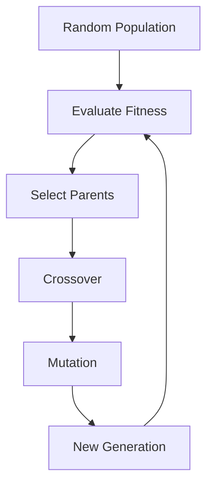
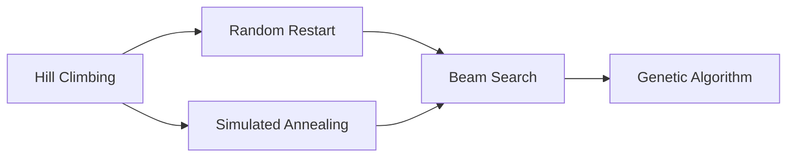

> [!info]+ Core Idea
> Unlike classical search algorithms (BFS, DFS, UCS, A*), **local search algorithms do not build paths from the start state to the goal.**
>
> Instead, they begin with **a complete candidate solution** and repeatedly improve it using local modifications.
>
> Local search is especially useful for **optimization problems**, where the objective is to find the *best* solution rather than merely *any* solution.

---

# Why Local Search?

Classical search keeps track of:

- the entire search tree,
- the frontier,
- explored states,
- parent pointers.

For very large optimization problems, this becomes computationally expensive.

Instead, local search asks:

> "Can I improve the current solution with a small change?"

Rather than exploring millions of paths, it incrementally improves a single solution.

## Typical Local Search Workflow

```text
Random Initial Solution
          │
          ▼
 Evaluate Current Solution
          │
          ▼
 Generate Neighboring Solutions
          │
          ▼
Choose the Best Neighbor
          │
          ▼
Repeat Until No Improvement
```

Unlike graph search, we usually store **only the current state**, making local search extremely memory efficient.

> [!important]+ Key Difference
> Classical search searches **through paths**.
>
> Local search searches **through complete solutions**.

# Example 1 — Traveling Salesman Problem (TSP)

## Problem

Given a set of cities,

find the shortest possible tour that:

- visits every city exactly once,
- returns to the starting city.

```
A → B → C → D → E → A
```

## Why is TSP Difficult?

For **n cities**, the number of possible tours grows approximately as

```
(n − 1)! / 2
```

which grows factorially.

Even relatively small instances become computationally intractable.

> [!warning]+ Computational Challenge
> TSP is an NP-hard optimization problem.
>
> Exhaustively checking every possible tour quickly becomes impossible.

---

# A Surprisingly Effective Heuristic

Suppose we randomly connect cities.

```
A ----- C
 \     /
  \   /
   \ /
   / \
  /   \
 B-----D
```

Notice the crossing edges.

A simple observation:

> Crossing edges almost always increase the total distance.

Instead of searching every possible route,

we repeatedly:

1. locate crossing edges,
2. uncross them,
3. keep the shorter route.

```
Before

A──────C
 \    /
  \  /
   \/
   /\
  /  \
 /    \
B──────D


After

A──────B
|              |
|              |
D──────C
```

Repeating this process often produces routes that are **within about 1% of optimal**, even for thousands of cities.

> [!tip]+ Design Philosophy
> "Do the stupid thing first.
> Add intelligence only when necessary."
>
> — Georgia Tech AI

# Example 2 — The N-Queens Problem

## Problem

Place **N queens** on an **N × N** chessboard so that no two queens attack each other.

Queens attack along:

- rows
- columns
- diagonals


## Example (4 Queens)

![[Pasted image 20260626181346.png|188]]
This arrangement is **not valid** because queens attack diagonally.

## Goal

Reduce

```
Number of Attacking Queen Pairs = 0
```

Instead of constructing a search tree,

we repeatedly move one queen.
![[Pasted image 20260626181604.png]]

Each move attempts to reduce the number of attacks.

---

# Heuristic Function

A heuristic evaluates the quality of the current board.

For N-Queens,

a natural heuristic is

```
h(board) = Number of attacking queen pairs
```

Our objective is

```
Minimize h(board)
```

Perfect solution

```
h(board) = 0
```


## Neighbor States

A neighboring state differs by moving one queen within its column.

Example

```
Current

Q
.
.
.

↓

Neighbor

.
Q
.
.
```

Every legal queen movement defines another neighboring solution.

---

# Hill Climbing

Hill climbing repeatedly chooses the neighboring solution with the greatest improvement.

Algorithm:

```
Current Solution
       │
Evaluate Neighbors
       │
Choose Best Neighbor
       │
Repeat
```

Unlike BFS,

there is

- no frontier,
- no explored list,
- no search tree.

Only the current solution is stored.

> [!note]+ Memory Advantage
> Hill climbing requires only **O(1)** or **O(n)** memory depending on the representation.

---

# Hill Climbing Example

Suppose we are maximizing a function.

![[Pasted image 20260626183447.png|580]]

Starting here

```
      x
```

Hill climbing moves uphill.

Eventually, reaches local minima

No neighboring state is better.

The algorithm stops.

Unfortunately, this may not be the highest mountain.

---

# Local Maximum

A **local maximum** is higher than every neighboring state,

but is **not** the highest point overall.

```
          Global Maximum
              /\
             /  \
            /    \
   /\      /
  /  \____/
 Local Maximum
```

Hill climbing becomes trapped here because every nearby move appears worse.

> [!warning]+ Local Maximum
> Hill climbing is greedy.
>
> It never intentionally takes a worse move,
> so it cannot escape a local optimum.

---

# Local Minimum (Minimization)

For minimization problems such as N-Queens,

the analogous trap is a **local minimum**.

```
Current attacks = 1

Every possible move

↓

2 attacks

↓

3 attacks

↓

4 attacks
```

No move improves the board,

even though a perfect solution exists elsewhere.

---

# Plateau (Shoulder)

Sometimes all neighboring states have identical value.
![[Pasted image 20260626183618.png|118]]

The algorithm cannot determine which direction to move.

This flat region is called a

- plateau,
- shoulder.

> [!warning]+ Plateau Problem
> The gradient is zero everywhere.
>
> Hill climbing has no guidance.

---

# Random Restart

One simple solution is
![[Pasted image 20260626183447.png|580]]

```
Hill Climb
     │
Gets Stuck
     │
Restart Randomly
     │
Hill Climb Again
```

Repeat many times.

Eventually,

one random initialization may begin close to the global optimum.

> [!important]+ Random Restart
> If each independent run has probability **p** of finding the global optimum,
>
> then repeated restarts increase the overall probability of success.

---

# Tabu Search

Instead of restarting blindly, remember where you've already been.

Maintain

```
Visited Local Optima
```

Never revisit them.

This prevents repeatedly becoming trapped in identical regions.

> [!note]+ Tabu Search
> "Tabu" literally means forbidden.
>
> Previously visited solutions become temporarily forbidden.

# Choosing the Step Size

Hill climbing depends heavily on how far we move.

## Step Size Too Small
![[Pasted image 20260626183907.png|256]]
Tiny movements may never reveal a nearby improvement.

The algorithm incorrectly believes it has converged.

## Step Size Too Large

Large jumps can skip over narrow peaks.
![[Pasted image 20260626184115.png|159]]

Instead of climbing,

the algorithm repeatedly jumps over the optimum.

Large steps may even create oscillation.

```
Left

↓

Right

↓

Left

↓

Right

↓

Forever
```

---
# Comparison

| Property | Classical Search | Local Search |
|-----------|------------------|--------------|
| Builds search tree | ✅ | ❌ |
| Stores frontier | ✅ | ❌ |
| Returns full path | ✅ | Usually ❌ |
| Uses little memory | ❌ | ✅ |
| Best for optimization | Sometimes | ✅ |

---

# Local Search Family

```text
Local Search
│
├── Hill Climbing
│      ├── Greedy improvement
│      ├── Local maxima problem
│      ├── Plateaus
│      └── Random Restart
│
├── Tabu Search
│
└── Simulated Annealing
       ├── Occasionally accepts worse moves
       ├── Escapes local optima
       └── Inspired by physical annealing
```


---

> [!summary]+ Key Takeaways
> - Local search works with **complete candidate solutions**, not search trees.
> - Optimization problems often require **iterative improvement** rather than exhaustive search.
> - Hill climbing is simple and memory efficient but easily becomes trapped in **local maxima**, **local minima**, and **plateaus**.
> - **Random restart** and **tabu search** improve robustness by exploring new regions of the search space.
> - The limitations of hill climbing motivate **simulated annealing**, which escapes local optima by occasionally accepting worse moves.
.

# Simulated Annealing

## Motivation

Hill climbing has one major weakness.

> [!failure] Hill Climbing Cannot Escape Local Maxima  
> Once every neighboring move is worse, the algorithm stops—even if a much better solution exists elsewhere.

We need an algorithm that occasionally allows **bad moves**.

Refer: [[Simulated Annealing]]

---

# Why Is It Called Annealing?

The idea comes from **materials science**.

When metals are heated:

- atoms move freely
    
- configurations become random
    

When cooled slowly:

- atoms settle into
    
- lower-energy
    
- highly organized crystal structures.
    

This process is called **annealing**.

## Physical Inspiration

Examples discussed in lecture:

- cooling lava forming hexagonal basalt columns
    
- mud cracks
    
- honeycombs
    
- sword making
    
- steel hardening
    

---

> [!example] Sword Making  
> Ancient sword makers repeatedly:
> 
> - heated steel
>     
> - allowed atoms to rearrange
>     
> - cooled slowly
>     
> 
> Slow cooling produced stronger crystal structures.
> 
> AI borrows exactly this idea.

---

# AI Analogy

Physics:

```
High Temperature
↓

Atoms move randomly

↓

Slow Cooling

↓

Lowest Energy State
```

AI:

```
High Temperature
↓

Search randomly

↓

Slow Cooling

↓

Best Solution
```

---

# Core Idea

Instead of always taking better moves, sometimes we intentionally accept worse moves.

Why?

Because they may eventually lead to a better solution.

## Simulated Annealing Algorithm

At every iteration:

1. Pick a nearby random state.
    
2. If it is better:
    
    - always accept.
        
3. If it is worse:
    
    - sometimes accept.
        

---

# Acceptance Probability

The probability of accepting a worse state is

```text
P = e^(ΔE / T)
```

Where

- ΔE = change in score
    
- T = temperature
    

---

> [!note]  
> In maximization:
> 
> ΔE = New Score − Current Score
> 
> Better move:
> 
> ΔE > 0
> 
> Worse move:
> 
> ΔE < 0

---

# Temperature Schedule

Temperature decreases over time.

```
High

100
 80
 60
 40
 20
 10
  5
  2
  1

↓

Eventually approaches zero
```

This schedule is called the **cooling schedule**.

---

# Behavior at High Temperature

Suppose

```
T → ∞
```

Then

```
ΔE / T ≈ 0

e^0 = 1
```

Meaning

```
Accept almost every move
```

---

> [!success] Interpretation  
> At high temperatures, the search behaves almost like a random walk.

## Visualization

```
Local Peak

     /\
    /  \
   •

Random motion

← ↑ ↓ →

Eventually escapes
```

The algorithm is **not trapped**.

---

# Behavior at Low Temperature

Suppose

```
T = 0.01

ΔE = -1
```

Then

```
P = e^(-100)
```

which is essentially

```
0
```

Meaning

```
Reject almost every worse move.
```

---

> [!important]  
> Low temperature behaves almost exactly like hill climbing.

---

# Plateau Behavior

Suppose

```
ΔE = 0
```

Then

```
e^(0) = 1
```

Meaning

```
Always accept sideways moves.
```

---

This allows simulated annealing to wander across flat plateaus until it finds a rising slope.

```
Plateau

──────────────

• → → → →

Eventually reaches

      /\
```

---

> [!tip]  
> Unlike hill climbing,  
> simulated annealing naturally escapes plateaus.

---

# Complete Simulated Annealing Behavior

```
High T

Random exploration

↓

Medium T

Mostly climbing
Occasional bad moves

↓

Low T

Almost pure hill climbing

↓

Converges
```

---

# Why Does Simulated Annealing Work?

Initially:

- explore everywhere
    

Later:

- exploit the best region
    

This balances

- exploration
    
- exploitation
    

---

> [!success] Theoretical Guarantee  
> If temperature decreases slowly enough,
> 
> simulated annealing is guaranteed to converge to the global optimum.
> 
> _(This is an asymptotic guarantee—it may require a very slow cooling schedule.)_

---

# Simulated Annealing vs Hill Climbing

|Property|Hill Climbing|Simulated Annealing|
|---|---|---|
|Takes worse moves|❌ Never|✅ Sometimes|
|Escapes local maxima|❌|✅|
|Escapes plateaus|❌|✅|
|Randomness|None|Controlled|
|Eventually behaves like hill climbing|❌|✅|

---

# Local Beam Search

Hill climbing keeps

```
1 particle
```

Local Beam Search keeps

```
k particles
```

simultaneously.

## Basic Idea

Instead of

```
One search

↓

One neighbor
```

we perform

```
k searches

↓

Generate neighbors

↓

Keep best k

↓

Repeat
```

## Diagram

```text
Iteration 1

A
B
C

↓

Generate Neighbors

A1 A2
B1 B2
C1 C2

↓

Choose Best 3

↓

Repeat
```

---

> [!note]  
> The particles share information.
> 
> This distinguishes Local Beam Search from Random Restart.

---

# Local Beam Search vs Random Restart

Random Restart

```
Search 1

(independent)

Search 2

(independent)

Search 3

(independent)
```

No communication.

---

Local Beam Search

```
Search 1
Search 2
Search 3

↓

All neighbors compared

↓

Keep global best k
```

Information is shared.

---

# Stochastic Beam Search

Instead of always choosing

```
Best neighbors
```

choose neighbors

```
Probabilistically
```

Better neighbors are more likely,

but weaker neighbors still have some chance.

---

> [!important]  
> This randomness helps prevent premature convergence to local maxima.

---

# Representing n-Queens

Because every column contains exactly one queen,

we only need to store

```
Row number
```

for each column.

Example

```
Columns

1 2 3 4 5 6 7 8

Rows

8 6 4 2 7 5 3 1
```

Representation

```text
86427531
```

---

> [!tip]  
> This representation is called the **chromosome** in genetic algorithms.

---

# Genetic Algorithms

Inspired by

```
Natural Evolution
```

Main idea

```
Population

↓

Selection

↓

Crossover

↓

Mutation

↓

New Population

↓

Repeat
```

---

# Fitness Function

There are

```
8 choose 2 = 28
```

possible queen pairs.

Fitness is defined as

```text
Fitness = 28 − Number of Attacking Pairs
```

Therefore

|Attacking Pairs|Fitness|
|---|---|
|0|28 (Perfect)|
|4|24|
|8|20|

---

> [!important]  
> Higher fitness = better board.

---

# Selection

Suppose fitness values are

|Board|Fitness|
|---|---|
|A|24|
|B|23|
|C|20|
|D|11|

Total fitness

```
78
```

Selection probabilities become

|Board|Probability|
|---|---|
|A|31%|
|B|29%|
|C|26%|
|D|14%|

---

> [!note]  
> This is **fitness-proportionate selection** (roulette wheel selection).

---

# Crossover

Parents

```
32752411

24748552
```

Random split

```
327 | 52411

247 | 48552
```

Child 1

```
32748552
```

Child 2

```
24752411
```

---

```text
Parent A

327 | 52411

Parent B

247 | 48552

↓

Children

32748552

24752411
```

---

# Mutation

Sometimes crossover alone cannot produce the optimal solution.

Therefore,

each gene has a small probability of changing randomly.

Example

```
32748552

↓

32748152
```

Only one position changed.

---

> [!warning]  
> Without mutation,  
> important genetic material may disappear forever from the population.

---

# Full Genetic Algorithm



---

# Why Mutation Matters

Without mutation

```
Population diversity

↓

decreases

↓

Search becomes stuck
```

With mutation

```
New genetic material

↓

New possibilities

↓

Escape local optima
```

---

# Similarities Between Local Search Methods

|Method|Uses Randomness?|Escapes Local Maxima?|
|---|---|---|
|Hill Climbing|❌|❌|
|Random Restart|✅|Often|
|Simulated Annealing|✅|Yes|
|Stochastic Beam Search|✅|Yes|
|Genetic Algorithm|✅|Yes|

---

# Big Picture



---

> [!summary] Key Takeaways
> 
> - Hill climbing is fast but easily trapped in local maxima and plateaus.
>     
> - Random Restart improves hill climbing by trying multiple initial states.
>     
> - Simulated Annealing accepts worse moves probabilistically, using a cooling schedule to transition from exploration to exploitation.
>     
> - Local Beam Search maintains multiple candidate solutions and shares information among them.
>     
> - Genetic Algorithms evolve a population through **selection**, **crossover**, and **mutation**.
>     
> - Randomness is not a flaw—it is a deliberate strategy for escaping poor local solutions and improving global optimization.


## Related Notes

- [[Chapter 3 - Solving Problems by Searching]]
- [[Search Algorithms]]
- [[Breadth-First Search]]
- [[Depth-First Search]]
- [[Uniform Cost Search]]
- [[Greedy Best-First Search]]
- [[A Star Search]]
- [[Heuristics]]
- [[Constraint Satisfaction Problems]]
- [[Optimization]]
- [[Simulated Annealing]]