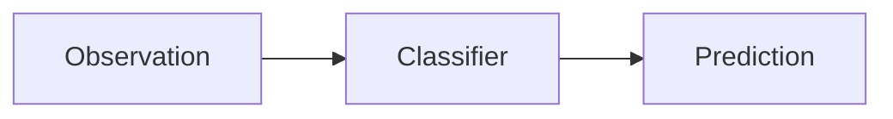
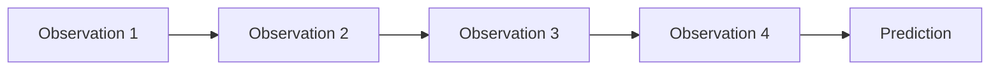
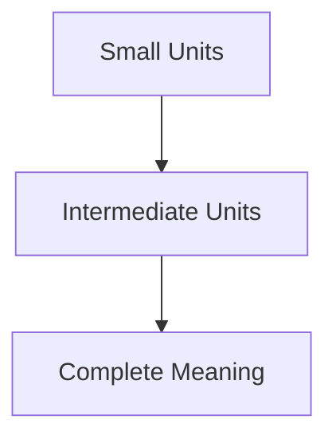
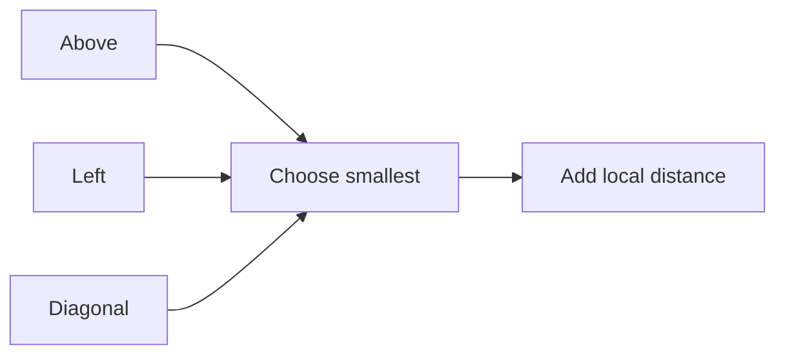
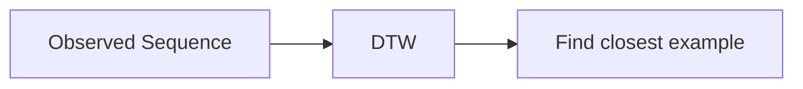
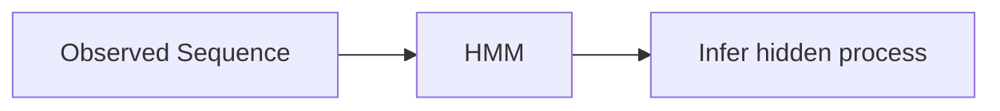
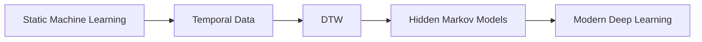

> [!note] note:
> ## From Static Machine Learning to Sequential AI
>
> Traditional machine learning usually treats each observation as an **independent example**.
>
> Pattern Recognition Through Time studies problems where **the order of observations carries meaning**.
>
> Instead of asking:
>
> > **"What is this object?"**
>
> we ask:
>
> > **"What happened over time?"**
>
> This small change completely transforms the learning problem.
>
> Before deep learning became dominant, **Dynamic Time Warping (DTW)** and **Hidden Markov Models (HMMs)** were the two most important algorithms for solving these problems.
>
> Today, RNNs, LSTMs and Transformers have largely replaced them, but almost every modern sequence model builds upon ideas introduced by DTW and HMMs.

---

# Why Time Changes Everything

Imagine seeing these letters.

```text
C
A
T
```

Everyone immediately recognizes

```text
CAT
```

Now simply rearrange them.

```text
T
A
C
```

The letters themselves are identical. Only their **order** changed.

Yet the meaning is completely different. This is the fundamental idea behind temporal pattern recognition:

> [!important] note:
> In sequential problems, **order is part of the information**.
>
> The same observations arranged differently can represent completely different meanings.

---

# Static vs Sequential Learning

Most introductory machine learning problems are **static**.

Each observation can be analyzed independently.



Examples include

- House price prediction
- Spam detection
- Credit approval
- Disease diagnosis from a medical record

The model never asks

> "What happened before?"

or

> "What happens next?"

Each example stands on its own.

## Sequential Learning

Temporal recognition is different.

Each observation gains meaning from its neighbors.



Earlier observations provide **context** for interpreting later ones.

Removing or reordering observations may completely change the result.

---

# Static vs Temporal Recognition

| Static Recognition | Pattern Recognition Through Time |
|-------------------|----------------------------------|
| One observation | Sequence of observations |
| Order unimportant | Order is essential |
| Independent examples | Correlated observations |
| Image classification | Speech recognition |
| Credit approval | Gesture recognition |
| Face image | Face video |

---

# Why Videos Are Easier Than Images

Suppose someone asks you to recognize a friend.

### One Photograph

```text
😐

(blurry)
```

This may be difficult.

---

### A Video

```text
🙂

↓

😄

↓

😁

↓

😆
```

Even if one frame is blurry, the remaining frames still reveal the person's identity. The sequence provides **redundant information**.

One bad observation rarely destroys the entire prediction.

---

> [!tip] :lucide-film:
> Many AI systems actually become **more reliable** when they observe an object over time rather than from a single snapshot.

---

# One Pattern Appears Everywhere

Many temporal problems have a surprisingly similar structure.

Small units combine into progressively larger structures.



Examples:

| Domain | Small Unit | Larger Structure |
|----------|------------|----------------|
| Speech | Phoneme | Word |
| Handwriting | Letter | Word |
| Music | Note | Melody |
| Sign Language | Gesture | Sentence |
| Human Motion | Limb movement | Activity |

Although these domains appear unrelated,

they all follow the same principle:

> Small building blocks combine according to statistical rules to produce meaningful sequences.

---

# Human Activities Are Like Languages

Sebastian Thrun makes an interesting observation.

Many everyday activities resemble language.

Consider making coffee.

```text
Reach

↓

Pick up mug

↓

Pour coffee

↓

Add milk

↓

Drink
```

Each movement is relatively simple.

The intelligence comes from **performing them in the correct order**.

Similarly,

driving,

playing basketball,

walking,

and vacuuming

are all sequences built from reusable movement primitives.

> [!insight] :lucide-brain:
> Temporal AI is often less about recognizing **individual observations**
>
> and more about recognizing
>
> **how observations are organized over time.**

---

# Dolphin Whistles

To motivate temporal recognition, the lecture introduces dolphin whistle classification. Marine biologists collect enormous amounts of underwater audio.

```text
🌊🌊🌊🌊🌊

🎤

↓

Hours of recordings
```

The objective is to automatically identify different whistle types.

Doing so helps researchers

- identify individual dolphins,
- study communication,
- and automatically annotate large audio databases.

---

# Why Not Listen to the Waveform?

Raw sound waves are difficult to interpret visually.

Instead,

we convert sound into a **spectrogram**.

A spectrogram displays

- time,
- frequency,
- and signal energy,

all at once.

Think of it as a **map of sound**.

---

# Spectrogram

```text
Frequency ↑

17 kHz |              ███

15 kHz |           █████

12 kHz |        █████

 9 kHz |     ████

 6 kHz |  ███

        +------------------------→ Time

Brightness = Signal Energy
```

Unlike a waveform,

a spectrogram clearly reveals how frequencies change over time.

This makes whistle shapes much easier to recognize.

> [!info] info
>
> A spectrogram answers three questions simultaneously:
>
> - **When** did something happen?
> - **At what frequency**?
> - **How strong was it?**

---

# The Ocean Is Noisy

Underwater recordings contain much more than dolphin whistles.

Typical low-frequency noise comes from

- 🌊 waves
- 🚢 boats
- 🌬 ocean movement
- 🐟 other marine life

Fortunately,

Atlantic spotted dolphin whistles usually occur between

```text
5 kHz — 17 kHz
```

Most background noise occurs at much lower frequencies.

```text
Frequency ↑

17 kHz | Dolphin whistles

12 kHz |

 8 kHz |

----------------------------

 3 kHz | Waves

 2 kHz | Boat engines

 1 kHz | Ocean noise
```

This allows many irrelevant sounds to be filtered out before recognition begins.

---

# Signature Whistles

One fascinating biological discovery is that many dolphins possess **signature whistles**.

These function similarly to human names.

```text
Human

"Ray!"

↓

One person responds.
```

Similarly,

```text
Dolphin

Unique whistle

↓

One dolphin responds.
```

Recognizing signature whistles allows scientists to identify individual dolphins without physically observing them.

---

# The Recognition Problem

Suppose the same dolphin produces two whistles.

### Whistle A

```text
/\____/\_
```

### Whistle B

```text
/ \__________/ \__
```

To humans,

both clearly sound like the same whistle.

The only difference is

- one was produced quickly,
- the other more slowly.

The **shape** is unchanged.

Only the timing differs.

---

# Choosing the Right Features

A machine learning model is only as good as its features.

The most obvious feature would be

> Absolute frequency.

Example:

| Time | Frequency (kHz) |
|------|----------------:|
| t₁ | 5 |
| t₂ | 14 |
| t₃ | 10 |
| t₄ | 7 |
| t₅ | 10 |
| t₆ | 14 |

Unfortunately,

two dolphins may produce the same whistle at slightly different pitches.

The absolute frequency changes,

even though the whistle pattern remains the same.

---

# Shape Matters More Than Pitch

Instead of storing frequency itself,

the lecture proposes storing the **change in frequency**.

| Frequency | Δ Frequency |
|-----------|------------:|
| 5 | — |
| 14 | +9 |
| 10 | −4 |
| 7 | −3 |
| 10 | +3 |
| 14 | +4 |

The sequence

```text
+9

↓

−4

↓

−3

↓

+3

↓

+4
```

captures

> **how the whistle moves**

rather than

> **where it starts.**

---

> [!important] :lucide-trending-up:
> Delta Frequency is more robust because it represents the **shape** of the whistle rather than its absolute pitch.

---

# Why Euclidean Distance Fails

Imagine two people saying the same word.

Person A speaks quickly.

```text
A B C D
```

Person B speaks slowly.

```text
A A B B C C D D
```

Humans instantly recognize

> "These are the same word."

Euclidean Distance disagrees.

Why?

Because it assumes

```text
A ↔ A

B ↔ A

C ↔ B

D ↔ B
```

Every observation must occur at exactly the same time.

Real temporal signals rarely satisfy this assumption.

---

# Another Intuition

Imagine two runners completing the same race.

Runner A finishes in

```text
10 minutes
```

Runner B finishes in

```text
14 minutes
```

Comparing them second-by-second makes little sense.

Instead,

we should compare

- start with start,
- halfway with halfway,
- finish with finish.

Temporal recognition requires exactly the same idea.

---

> [!warning] :lucide-triangle-alert:
> Ordinary distance metrics assume observations occur at identical time steps.
>
> Most temporal signals differ **only in timing**, not in meaning.

---

# Looking Ahead

The inability of Euclidean Distance to handle different speaking speeds leads directly to the next algorithm:

> **Dynamic Time Warping (DTW)**

Instead of forcing observations to line up perfectly,

DTW **warps the time axis** so similar events align before measuring similarity.

This idea became one of the foundations of temporal pattern recognition.

---

# Key Takeaways

> [!summary] :summary:
>
> - Sequential AI studies **ordered observations** rather than isolated examples.
> - The same observations arranged differently can represent different meanings.
> - Many real-world problems (speech, handwriting, gestures, music, activities) share the same hierarchical sequence structure.
> - Spectrograms transform sound into an image showing **time**, **frequency**, and **energy**.
> - Dolphin signature whistles function much like human names.
> - Good feature engineering focuses on **shape**, not absolute measurements.
> - Delta Frequency is more robust than raw frequency because it captures changes in the whistle.
> - Euclidean Distance fails whenever similar sequences occur at different speeds.
> - Dynamic Time Warping (DTW) solves this timing problem by aligning sequences before comparing them.

---
# Dynamic Time Warping (DTW)

> [!info] :lucide-git-branch:
> ## The Core Idea
>
> Humans naturally recognize patterns even when they happen at different speeds.
>
> A person saying **"hello"** quickly and another saying it slowly are still saying the same word.
>
> Traditional distance measures compare observations **at the same time index**, while **Dynamic Time Warping (DTW)** first aligns similar events in time and **then** measures similarity.
>
> In other words,
>
> > DTW compares **events**, not **timestamps**.

---

# The Problem DTW Solves

In the previous section, we saw that Euclidean Distance assumes

```text
Time 1 ↔ Time 1

Time 2 ↔ Time 2

Time 3 ↔ Time 3
```

This assumption works only when two sequences evolve at exactly the same speed.

Real-world sequences rarely do.

Imagine two dolphins producing the same whistle.

```text
Whistle A

/\____/\_
```

```text
Whistle B

/ \__________/ \__
```

Nothing important has changed except **time**.

The whistle was simply stretched.

Humans immediately recognize this.

A computer needs a way to do the same.

---

# Time Is Flexible

Imagine watching two people clap.

Person A

```text
👏 👏 👏 👏
```

Person B

```text
👏   👏    👏      👏
```

The rhythm differs,

but the sequence of events is identical.

Instead of asking

> "Did they clap at exactly the same moment?"

DTW asks

> "Which clap corresponds to which?"

This small change is the entire philosophy behind DTW.

---

# Why Alignment Matters

Suppose two students write the same signature.

Student A writes quickly.

```text
██████
```

Student B writes slowly.

```text
████████████████
```

Although one signature contains many more sampled points,

both represent the same pen movement.

Comparing point-by-point would incorrectly conclude they are different.

Instead,

we should align

```text
Beginning

↓

Middle

↓

End
```

rather than

```text
Sample 1

↓

Sample 1
```

---

> [!important] :lucide-clock-arrow-up:
> DTW assumes that **important events should align**, even if they occur at different times.

---

# Euclidean Distance vs DTW

Imagine two hikers walking the same trail.

Hiker A walks quickly.

Hiker B stops frequently to take photographs.

Their GPS recordings contain different numbers of points.

Euclidean Distance compares

```text
Point 1 ↔ Point 1

Point 2 ↔ Point 2

Point 3 ↔ Point 3
```

DTW instead compares

```text
Same location

↓

Same location

↓

Same location
```

regardless of how long each person spent there.

This is why DTW often feels more "human."

---

# The Main Idea Behind Warping

Rather than stretching the signal itself,

DTW stretches the **time axis**.

```text
Original

A B C D
```

becomes aligned with

```text
A A B B C C D
```

Notice that

- observations are never reordered,
- events remain in the same sequence,
- only their timing changes.

This preserves the structure of the signal while allowing different speaking speeds.

---

# Visualizing Time Warping

Without alignment

```text
Signal A

/\____/\_
```

```text
Signal B

/ \__________/ \__
```

Point-by-point comparison

```text
❌ Peaks occur at different times
```

After warping

```text
Signal A

/\________/\_
```

```text
Signal B

/\________/\_
```

Now

```text
✔ Peaks align
✔ Valleys align
✔ Shape matches
```

---

# The Alignment Matrix

To find the best alignment,

DTW compares **every point** in one sequence with **every point** in the other.

Imagine laying the two sequences along the edges of a grid.

```text
            Sequence X

        x₁ x₂ x₃ x₄

      ┌───────────────

 y₁   │ □ □ □ □

 y₂   │ □ □ □ □

 y₃   │ □ □ □ □

 y₄   │ □ □ □ □
```

Every square answers the question

> "How similar are these two observations?"

This grid is called the **cost matrix**.

---

# Local Cost

Each cell stores a **local distance**.

For example,

if

```text
x₂ = 10

y₃ = 12
```

then

```text
Cost

=

|10−12|

=

2
```

Small values indicate

```text
Good match
```

Large values indicate

```text
Poor match
```

At this stage,

every comparison is still completely independent.

---

# Finding the Best Overall Alignment

The cheapest individual matches do not necessarily produce the best sequence.

Instead,

DTW searches for the **best path** through the matrix.

```text
Start

●══════╗

        ║

        ╚════╗

             ║

             ╚══════●

Finish
```

Each step extends the alignment while respecting the order of observations.

---

> [!tip] :lucide-route:
> Think of the path as connecting **corresponding events** in two different timelines.

---

# Why Can't the Path Jump Anywhere?

The path must satisfy several intuitive rules.

## 1. Start Together

The beginning of one sequence should align with the beginning of the other.

```text
✔ Start → Start
```


## 2. Finish Together

The end should align with the end.

```text
✔ End → End
```


## 3. Never Go Backwards

Time cannot reverse.

```text
A → B → C
```

is valid.

```text
A → C → B
```

is impossible.

This keeps the chronological order intact.

---

# Dynamic Programming Appears Again

Exploring every possible alignment would be computationally impossible.

Instead,

DTW uses the same powerful idea we encountered in Value Iteration:

> Solve many small problems instead of one enormous one.

Each cell only depends on previously solved neighboring cells.

---

# The DTW Recurrence

The cumulative alignment cost is

$$
DTW(i,j)
=
d(i,j)
+
\min
\begin{cases}
DTW(i-1,j)\\
DTW(i,j-1)\\
DTW(i-1,j-1)
\end{cases}
$$

Instead of understanding this as a formula,

think of it as a traveler crossing the grid.

At every square,

the traveler asks

> "Which previous route was cheapest?"

Then simply adds today's local cost.

---




> [!note]
> This recurrence is almost identical in spirit to the Bellman updates from MDPs.
>
> Both algorithms repeatedly build optimal solutions from previously solved subproblems.

---

# Why This Is Dynamic Programming

Notice what happens.

To compute

```text
Current Cell
```

we never recompute the entire path.

We simply reuse the best answers already computed.

```text
Past Solutions

↓

Current Solution

↓

Future Solutions
```

This reuse of previous work is exactly what makes Dynamic Programming efficient.

---

# Over-Warping

DTW is extremely flexible.

Sometimes,

too flexible.

Imagine trying to match

```text
Cat
```

with

```text
Caaaaaaaaaaaaaaaaaat
```

A very flexible alignment might still claim

```text
Perfect Match
```

even though the timing difference is unrealistic.

This phenomenon is called **over-warping**.

---

# Sakoe–Chiba Band

To prevent unrealistic alignments,

DTW often restricts how far the path may wander from the diagonal.

```text
Allowed Region

//////////////////

////████████////

//////////////////
```

The highlighted band represents the only region where the alignment path may travel.

Outside the band,

matching is forbidden.

---

# Why Restrict the Path?

Constraining the alignment has several advantages.

✔ Prevents absurd matches

✔ Reduces computation

✔ Produces more realistic alignments

✔ Improves recognition accuracy

Choosing the band width is usually done experimentally using validation data.

---

# Where DTW Excels

DTW works especially well whenever the **shape** matters more than **timing**.

Typical applications include

- 🎤 Speech recognition
- ✍️ Handwriting recognition
- 🤟 Sign language
- 🐬 Dolphin whistles
- ❤️ ECG analysis
- 🚶 Human motion
- 📈 Financial time series

The common characteristic is

> Similar events occur at different speeds.

---

# Limitations

Although DTW is powerful,

it is not a complete probabilistic model.

Limitations include

- Computationally expensive for very long sequences.
- Can still over-warp unrelated signals.
- Requires constraints such as Sakoe–Chiba bands.
- Measures similarity but **does not model hidden states or sequence generation**.

These limitations motivate the next major algorithm in the course:

> **Hidden Markov Models (HMMs).**

Rather than simply comparing sequences,

HMMs learn **how sequences are generated**.

---

# DTW vs Euclidean Distance

| Euclidean Distance | Dynamic Time Warping |
|-------------------|----------------------|
| Fixed alignment | Flexible alignment |
| Same length preferred | Different lengths handled naturally |
| Compares timestamps | Compares corresponding events |
| Fast | More computationally intensive |
| Sensitive to speed | Robust to different speeds |
| No Dynamic Programming | Uses Dynamic Programming |


# Mental Model

> [!success] 
>
> Imagine watching two dancers perform the same choreography.
>
> One dancer moves faster.
>
> The other pauses longer.
>
> Euclidean Distance compares them **frame by frame**.
>
> DTW instead aligns
>
> - first jump ↔ first jump
> - first spin ↔ first spin
> - final pose ↔ final pose
>
> regardless of when those movements occurred.

---

# Looking Ahead

DTW solves one important problem:

> **How similar are two sequences?**

The next question is fundamentally different:

> **How can a computer learn the statistical structure that generated those sequences?**

That question leads naturally to

[[Hidden Markov Models (HMM)]]


# Key Takeaways

> [!summary]
>
> - DTW compares **events**, not timestamps.
> - Time is allowed to stretch or compress while preserving order.
> - Similar sequences spoken at different speeds become properly aligned.
> - The alignment is computed using a Dynamic Programming recurrence.
> - A cost matrix stores cumulative alignment costs.
> - The optimal warping path represents the best correspondence between two sequences.
> - Sakoe–Chiba Bands prevent unrealistic alignments.
> - DTW measures similarity but does not explain how sequences are generated.
> - This limitation motivates Hidden Markov Models, which model the underlying stochastic process itself.

# Beyond Dynamic Time Warping: Why Hidden Markov Models?

> [!info] 
> ## From Matching Sequences to Understanding Them
>
> After studying Dynamic Time Warping (DTW), a natural question arises:
>
> > **"If DTW works so well, why do we need another algorithm?"**
>
> The answer is subtle but important.
>
> DTW is an excellent **comparison algorithm**.
>
> It tells us **how similar two sequences are**.
>
> But it cannot answer deeper questions such as:
>
> - *How was this sequence generated?*
> - *What stage of the process are we currently in?*
> - *What observation is likely to come next?*
> - *How can we learn from many examples instead of comparing against a template?*
>
> Hidden Markov Models (HMMs) were developed to answer these questions.


---

# Two Different Problems

Although DTW and HMMs both work with sequential data, they solve very different problems.

## DTW asks

> "How similar are these two sequences?"

Example

```text
Unknown whistle

↓

Compare with Template A

↓

Compare with Template B

↓

Compare with Template C

↓

Choose smallest distance
```


## HMM asks

> "What process most likely produced this sequence?"

Instead of comparing against one template,

it tries to understand the **hidden mechanism** generating the observations.

> [!important]
> DTW compares **finished sequences**.
>
> HMMs model the **process that creates those sequences**.

---

# An Analogy: Reading Footprints

Imagine walking along a beach. You discover footprints.

```text
🐾 🐾 🐾 🐾 🐾
```

DTW asks

> "Which known animal's footprints look most similar?"

HMM asks

> "What animal was probably walking here, and what path did it take?"

The footprints are visible. The animal is not. The animal represents the **hidden state**.

---

# Why Templates Become a Problem

Suppose we build a speech recognizer.

We record one example of the word

```text
Hello
```

Later someone says

```text
Hello
```

slightly faster. DTW aligns the sequences. Everything works.

---

Now suppose we have

```text
50 words
```

Each spoken by

```text
100 people
```

Each at

```text
5 different speaking speeds
```

Suddenly we have

```text
50 × 100 × 5

=

25,000 templates
```

Searching through all of them quickly becomes expensive.

---

# Humans Don't Memorize Templates

Think about how children learn language.

A child does **not** memorize

```text
Hello #1

Hello #2

Hello #3

Hello #4
```

Instead, the child gradually learns

- how sounds change,
- which sounds commonly follow others,
- how words are structured.

Humans learn a **model** of speech, not an enormous library of examples. HMMs try to imitate this idea.

---

# Recognizing vs Modeling

These are two different goals.



versus



One searches.

The other reasons.

---

# Hidden Structure Exists Everywhere

Many sequential problems have information we cannot observe directly.

For example,

## Speech

We hear

```text
Sound waves
```

We do **not** directly observe

```text
Phonemes
```

that generated them.

## Handwriting

We observe

```text
Ink on paper
```

We do **not** observe

```text
Pen movements
```

that produced the writing.

## Human Activity

We observe

```text
Accelerometer readings
```

We do **not** directly observe

```text
Walking

Running

Standing
```

The hidden process must be inferred.

---

# Visible vs Hidden

This distinction becomes the central idea behind HMMs.

```text
Hidden World

↓

Unknown internal state

↓

Produces

↓

Visible observations
```

The observations are easy to measure.  The underlying state is not.

> [!tip] :lucide-eye-off:
> Many AI problems involve predicting something **we cannot directly observe** from something **we can**.

---

# Another Example: The Ocean

Imagine listening to underwater recordings.

We observe

```text
🔊 Sound
```

We cannot directly observe

```text
🐬 Which dolphin produced it?
```

or

```text
🐬 What behavioral state was the dolphin in?
```

The sound is visible. The behavioral state is hidden. Again, this is exactly the type of reasoning HMMs are designed for.

---

# Thinking Like a Scientist

Imagine a doctor examining a patient. The doctor observes

- temperature,
- cough,
- blood pressure,
- oxygen level.

The doctor cannot directly observe

```text
Disease
```

Instead, the doctor infers it.

```text
Symptoms

↓

Reasoning

↓

Hidden illness
```

This is almost exactly how an HMM works.

---

# Where Dynamic Programming Returns

One interesting connection with previous lectures is that Dynamic Programming appears again.

Earlier we saw it in

- Value Iteration
- Dynamic Time Warping

Soon, we will encounter it once more inside HMM algorithms.

Different problem. Same computational philosophy.

```text
Large problem

↓

Break into smaller subproblems

↓

Reuse previous solutions

↓

Efficient algorithm
```

This is becoming a recurring pattern throughout AI.

---

# The Historical Perspective

Before deep learning, the typical speech recognition pipeline looked like this.

```text
Audio

↓

Feature Extraction

↓

Hidden Markov Model

↓

Recognized Words
```

For nearly two decades,

HMMs were the dominant technology behind commercial speech recognition systems.

Companies like

- IBM
- Microsoft
- Nuance
- Google (early systems)

all relied heavily on HMMs. Although modern systems use Transformers, many of the probabilistic ideas introduced by HMMs remain fundamental.

---

# Comparing the Evolution

It helps to think of Lecture 8 as a progression.



Each step answers a more sophisticated question.

## Static ML

Can I classify one observation?

## Temporal Recognition

How do I classify sequences?

## DTW

How similar are two sequences?

## HMM

What hidden process generated this sequence?

## Deep Learning

Can a neural network automatically learn the hidden representation?

---

# A Mental Model

Imagine watching a play from behind a curtain.

You cannot see the actors.

You only hear sounds.

```text
 Behind curtain

↓

Hidden actors

↓

Visible dialogue
```

Your task is to infer

- who is speaking,
- what scene is happening,
- what will probably happen next.

This is exactly the intuition behind Hidden Markov Models.

The hidden actors correspond to

```text
Hidden States
```

The dialogue corresponds to

```text
Observations
```

---

# Preparing for Hidden Markov Models

Everything we have learned so far now becomes useful.

We already understand

✔ Sequential data

✔ Temporal alignment

✔ Dynamic Programming

✔ Probabilistic reasoning (from MDPs)

The only missing idea is

> **How to represent hidden states probabilistically.**

That is the central topic of the next lecture.

---

# Big Picture

Lecture 8 is really about one gradual shift.

```text
Static observations

↓

Sequences

↓

Sequence comparison

↓

Sequence generation

↓

Hidden probabilistic structure
```

Notice how each stage asks a deeper question about the data.

---

# Summary

> [!summary] :lucide-list-checks:
>
> - DTW solves a **matching** problem, not a **modeling** problem.
> - Template matching becomes difficult as datasets grow larger and more variable.
> - Many real-world processes contain **hidden states** that cannot be directly observed.
> - HMMs explicitly model these hidden states and the observations they produce.
> - Dynamic Programming appears again because it is a powerful strategy for reasoning efficiently over sequences.
> - Lecture 8 forms the bridge between **sequence comparison (DTW)** and **probabilistic sequence modeling (HMMs)**.

