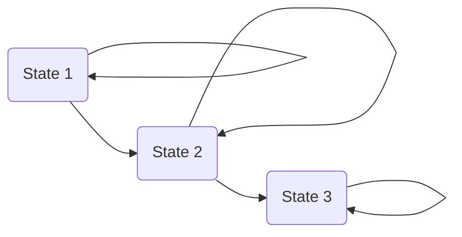
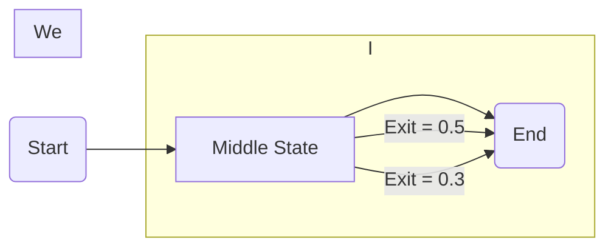
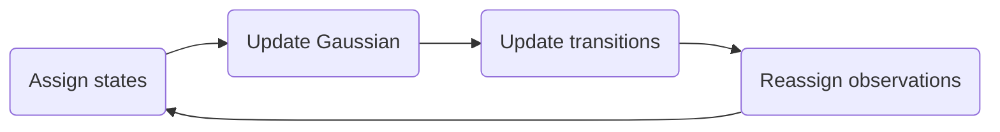

# Hidden Markov Models (HMMs)

> [!insight]  
> A **Hidden Markov Model (HMM)** is a probabilistic model used to represent sequential data whose underlying states cannot be observed directly.
> 
> Instead of observing the states themselves, we observe outputs (emissions) that are generated by those hidden states.
> 
> Hidden Markov Models are widely used in speech recognition, handwriting recognition, sign language recognition, gesture recognition, biological sequence analysis, and many other temporal pattern recognition problems.

Related Notes:
[[Lecture 8 - Pattern Recognition Through Time - Part I]]

# Why Hidden Markov Models?

Dynamic Time Warping compares two sequences by finding the best alignment.

However, many recognition problems require something more powerful.

Rather than comparing one signal against another, we want to model an **entire class of signals**.

For example

- the word "hello"
    
- a dolphin whistle
    
- a sign language gesture
    

Each may have many valid variations.

Instead of storing every possible example, we build a probabilistic model describing how that signal is generated.

---

> [!example]  
> Many people pronounce the same word differently.
> 
> Rather than memorizing every pronunciation,  
> an HMM models the probability of generating all valid pronunciations.

---

# Markov Models

An HMM is based on a **Markov Model**.

A Markov Model consists of

- states
    
- transitions between states
    

Each state represents part of a process.

Transitions describe how the process evolves over time.

## First-Order Markov Property

The lecture considers **First-Order Markov Models**.

This means

> the next state depends **only on the current state**.

It does **not** depend on the entire history.

Mathematically,

$$  
P(S_t|S_{t-1},S_{t-2},...,S_1)

P(S_t|S_{t-1})  
$$

> [!important]  
> Only the immediately preceding state influences the next state.

---

# Why Are They "Hidden"?

In ordinary Markov Models,

the states are directly observable.

Hidden Markov Models are different.

The states themselves cannot be observed.

Instead,

each state generates an observable output.

```text
Hidden States

State 1 → State 2 → State 3

      ↓         ↓         ↓

 Observation Observation Observation
```

We only observe

- speech samples
    
- gestures
    
- whistle frequencies
    
- handwriting
    

The sequence of hidden states must be inferred.

> [!insight]  
> We never directly observe the hidden states.
> 
> We only observe the outputs produced by those states.

---

# Applications

The lecture discusses several applications.

Examples include

- Speech Recognition
    
- Handwriting Recognition
    
- Sign Language Recognition
    
- Gesture Recognition
    
- Dolphin Whistles
    

These problems all possess a language-like structure.

---

# Representing an HMM

The Russell & Norvig textbook represents HMMs as a chain through time.

```text
X₀ → X₁ → X₂ → X₃

      ↓     ↓     ↓

     E₁    E₂    E₃
```

where

- X = hidden state
    
- E = observed output
    

The lecture instead uses a **state diagram**, which is more intuitive.

```text
       ┌──────┐
   ┌──►│ State1  │───┐
   │      └──────┘       │
   │           │                 │
   │           ▼                 │
   │      ┌──────┐        │
   └───│State2  │───┘
       └──────┘
```

---

# Left-to-Right HMM

The lecture uses a **Left-to-Right HMM**.

In this model,

once a state is left,

it cannot be revisited.

```text
State1 → State2 → State3 → State4
```

Backward transitions are not allowed.

Each state also contains a **self-transition**.

```text
        ↺
       State 1

        │
        ▼

       State 2
```

Self-transitions allow the model to remain in the same state for multiple time steps.

---

> [!important]  
> Left-to-right HMMs are especially useful for speech, gestures, handwriting, and sign language because these naturally progress forward through time.

---

# States

Each state models one portion of the signal.

Example

Suppose a signal consists of four distinct sections.

```text
Signal

____
    \____
         \____
              \____
```

A simple HMM may use four states.

```text
S₁ → S₂ → S₃ → S₄
```

Each state models one section of the signal.

---

# Emission Probabilities

Every state produces observations.

These are called

**Emission Probabilities**

The lecture also refers to them informally as

**Alpha Probabilities**.

Each state defines the values it is likely to emit.

Example

State 1

Possible outputs

-2 -------- -1
██████████████

State 2
-1 -------- 0
██████████████

State 3
0 -------- 1
██████████████

State 4
1 -------- 2
██████████████

The lecture uses simple **boxcar distributions** because every value inside the interval is equally likely.

---

# Transition Probabilities

States are connected by transition probabilities.

Example

```text
      0.9
   ↺

State1

   │0.1

   ▼

State2
```

The probability of leaving a state determines

how long the model is expected to remain there.

All outgoing probabilities from a state must sum to 1.

---

# Expected Duration

Suppose

```text
Self Transition = 0.9
```

The expected number of frames spent in that state is

$$  
E[T]

\frac{1}{1-p_{self}}  
$$

Example

$$  
\frac{1}{1-0.9}

10  
$$

The model therefore expects to remain in that state for approximately **10 time frames**.


> [!tip]  
> Increasing the self-transition probability increases the expected duration of that state.

---

# Building an HMM by Inspection

The lecture demonstrates manually constructing an HMM.

The process is

1. Divide the signal into meaningful sections.
    
2. Create one state for each section.
    
3. Define emission distributions.
    
4. Estimate transition probabilities from timing.
    

Example

```text
Signal

Section A

Section B

Section C

Section D

↓

S₁ → S₂ → S₃ → S₄
```

---

> [!note]  
> In practice, HMMs are usually trained from many examples.
> 
> However, constructing an HMM manually provides a useful first approximation.

---

# Sign Language Example

The lecture demonstrates HMMs using two signs

- **I**
    
- **We**
    

Interestingly,

only **Δy (change in vertical position)** is used as the feature.

Although Δx would separate the gestures more easily,

the lecture intentionally chooses a poorer feature to demonstrate how powerful HMMs can be.

## HMM for "I"

The gesture naturally divides into

1. Raise arm
    
2. Pause
    
3. Lower arm
    

Each motion becomes one state.

```text
Raise

↓

Pause

↓

Lower
```

The pause is short,

so its self-transition probability is smaller.

## HMM for "We"

The gesture contains

- greater variation
    
- longer middle section
    

Therefore

- the middle state's emission distribution is wider
    
- its self-transition probability is larger
    

This allows the model to remain in the middle state longer.

> [!example]  
> Even when two gestures have similar movements,
> 
> differences in timing can distinguish them.

---

# Recognition

Suppose an unknown observation sequence

$$  
O  
$$

is collected.

We compute

$$  
P(O|\lambda)  
$$

where

- $O$ = observation sequence
    
- $\lambda$ = HMM
    

The model with the highest probability is considered the correct match.

Because the sequence of hidden states is unknown,

the recognition algorithm must determine the most likely path through the HMM.

This leads directly to the **Viterbi Algorithm**, covered in the next note.

---

# Advantages of Hidden Markov Models

✔ Models sequential data

✔ Handles variable-duration signals

✔ Represents uncertainty probabilistically

✔ Supports recognition of many temporal patterns

✔ Widely used in speech and gesture recognition

---

# Limitations

✘ Hidden states must be inferred

✘ Training can be computationally expensive

✘ Model design requires selecting appropriate states and transition probabilities

---

# Summary

|Concept|Description|
|---|---|
|Hidden State|Internal state that cannot be observed directly|
|Observation|Visible output generated by a state|
|Transition Probability|Probability of moving between states|
|Emission Probability|Probability of producing an observation|
|Self Transition|Probability of remaining in the same state|
|Left-to-Right HMM|Forward-only state transitions|
|Expected Duration|Average time spent in a state|
|Recognition|Determine which HMM best explains an observation sequence|


## See Also

- [[Lecture 8 - Pattern Recognition Through Time - Part I]]
    
- [[Dynamic Time Warping]]
    
- [[Viterbi Algorithm]]
    
- [[Lecture 6 - Bayesian Networks I — Foundations & Bayes Rule]]
    
- [[3 - Probability]]


> [!summary]
> A **Hidden Markov Model (HMM)** is a probabilistic model used to recognize **patterns that unfold over time**, such as speech, handwriting, sign language, gestures, and biological sequences.

Unlike Dynamic Time Warping (DTW), which compares two sequences directly, an HMM **learns a probabilistic model of an entire class of sequences**.

## Why HMMs?

Many real-world signals consist of several distinct stages.

Examples include

- Speech → phonemes → words → sentences
- Handwriting → strokes → letters → words
- Sign language → movements → gestures → phrases
- Dolphin whistles → whistle segments
- Human activities → movement primitives

Instead of comparing one sequence to another, HMMs model

> "How could this sequence have been generated?"


## Markov Models

A Markov Model consists of

- States
- Transition probabilities

The defining assumption is the **First-Order Markov Property**.

> [!important]
> The next state depends **only on the current state**, not the complete history.

Mathematically,

$$
P(S_t|S_{t-1},S_{t-2},...,S_0)
=
P(S_t|S_{t-1})
$$

## Why are they called Hidden?

The system moves through internal states.

However,

**we cannot directly observe those states.**

Instead, each state produces an observable output.
Observable sequence

Output:

o₁   o₂   o₃   o₄   o₅

▲    ▲    ▲    ▲    ▲

Hidden states:

S₁ → S₂ → S₂ → S₃ → S₄
We only observe

Outputs

↓

o₁ o₂ o₃ o₄ o₅

The sequence of hidden states must be inferred.

This is the central problem solved by HMM decoding.

## Components of an HMM

Every Hidden Markov Model contains three components.

### 1. States

States represent hidden stages of the process.

Example

A gesture may consist of

- Raise arm
- Pause
- Lower arm

Each becomes one hidden state.

---

### 2. Transition Probabilities

These describe

> the probability of moving from one state to another.

Example

State 1
  │0.2
  ▼
State 2

State 1
  ▲
0.8


Large self-transition probability means

> stay in that state longer.

---

### 3. Emission Probabilities

Each state generates observations.

These are called

- Output probabilities
- Emission probabilities

The lecture also refers to them as

> Alpha probabilities

Example

State 1

Outputs:

-2 -1.8 -1.5 -1.2

Higher probability

████████

Lower probability

██


---

# Left-to-Right HMM

Many recognition problems naturally move forward through time.

Speech
Beginning

↓

Middle

↓

End

Sign language
Raise arm

↓

Pause

↓

Lower arm


For these problems we use a

**Left-to-Right HMM**
State1 → State2 → State3 → State4

Notice

There are **no backward transitions.**

## Self Transitions

Each state usually contains a loop back to itself.
      ┌─────┐
      │             │
      ▼            │
State 2 ───► State 3


The self-loop represents

> Remaining in the same state for multiple time steps.

Without self transitions

every state would last exactly one frame.

---

# Example Signal

Suppose we observe this signal.

Value

 2 |                          _______
 1 |                 ________|
 0 |        ________|
-1 |_____  __ |
-2 |

    ------------------------------→ Time

The lecture divides this signal into

- State 1
- State 2
- State 3
- State 4

Each state models one section of the signal.

---

# Emission Distributions

Each state models the values expected while the system remains in that state.

Lecture example

| State | Expected Values |
|--------|-----------------|
| S1 | -2 to -1 |
| S2 | -1 to 0 |
| S3 | 0 to 1 |
| S4 | 1 to 2 |

The lecture uses simple **box-car (uniform) distributions** for illustration.
Probability

████████

────────────

-2     -1

In real systems,

Gaussian distributions are usually used.

---

# Transition Probabilities

Suppose the first segment lasts

10 frames.

We want to stay in State 1 most of the time.

Example
S1

↺ 0.90

↓

0.10

S2

Interpretation

- 90% chance of remaining in State 1
- 10% chance of moving forward

---

# Expected Time in a State

A useful formula from the lecture

$$
\boxed{
\text{Expected Frames}
=
\frac{1}
{1-P_{\text{self}}}
}
$$

Examples

| Self Transition | Expected Frames |
|----------------:|----------------:|
| 0.50 | 2 |
| 0.80 | 5 |
| 0.90 | 10 |
| 0.95 | 20 |

This provides an intuitive way to choose transition probabilities.

> [!tip]
> Larger self-transition probability means the model expects the process to remain in that state longer.

---

# Entering the Model

Many diagrams explicitly include an entry arrow.
Start

↓

State1 → State2 → State3
Some HMM toolkits instead create a **dummy start state** before State 1.

Both represent entering the model.

---

# Building an HMM by Inspection

The lecture demonstrates constructing an HMM manually.

Steps

1. Divide the signal into logical segments.
2. Create one hidden state per segment.
3. Estimate emission distributions.
4. Estimate transition probabilities from timing.
5. Add self-transitions.
6. Connect states in order.

This provides a useful first approximation before training.

---

> [!example]
> **Signal**
> Rise
>↓
>Hold
>↓
>Fall


Possible HMM
Start

↓

[Rise]
 ↺

↓

[Hold]
 ↺

↓

[Fall]
 ↺

↓

End

---

# Summary

| Component | Purpose |
|------------|----------|
| Hidden State | Represents an unobserved stage |
| Observation | Measured data |
| Emission Probability | Likelihood of producing an observation |
| Transition Probability | Probability of changing states |
| Self Transition | Remaining in the same state |
| Left-to-Right HMM | Never moves backwards |
| Expected Duration | $\frac{1}{1-P_{self}}$ |

> [!important]
> HMMs model **how a sequence is generated**, not simply how similar two sequences are. They learn both **what observations are expected** and **how the process evolves through time**.

# Sign Language Recognition using Hidden Markov Models

> [!summary]  
> The lecture demonstrates how **Hidden Markov Models (HMMs)** can recognize sign language by modeling the **temporal structure of gestures**. Even when the chosen feature is not ideal, HMMs can successfully distinguish gestures because they learn both the **expected observations** and **how long each part of the gesture typically lasts**.

---

# Why Sign Language?

Sign language is an excellent application of HMMs because every sign unfolds over time.

A gesture is not simply a single image—it is a sequence of movements.

For example

```
Raise hand
      ↓
 Pause briefly
      ↓
 Lower hand
```

Each movement lasts for some period of time and occurs in a specific order.

HMMs are designed to model exactly this type of sequential process.

---

# The Example Gestures

The lecture compares two similar gestures.

```
Gesture 1

"I"
```

and

```
Gesture 2

"We"
```

Although these gestures look similar, they differ in

- movement timing
    
- duration of each stage
    
- variation in movement
    

The goal is to determine which gesture most likely produced an observed sequence.

---

# Choosing Features

The lecture deliberately chooses a poor feature to demonstrate the strength of HMMs.

Instead of using horizontal movement (**Δx**), which would separate the gestures more easily, it uses only

## Delta Y (Δy)

Δy measures the change in vertical position between consecutive frames.

If

|Frame|Y Position|
|---|--:|
|1|10|
|2|13|
|3|15|
|4|14|

then

|Frame|Δy|
|---|--:|
|2|+3|
|3|+2|
|4|-1|

Positive values indicate upward movement.

Negative values indicate downward movement.

Zero indicates little or no vertical movement.

---

# Why Use a Poor Feature?

The instructor intentionally chooses Δy because

> [!important]  
> Even though Δy alone is not sufficient to distinguish the gestures, HMMs can still recognize them by modeling **timing**.

This demonstrates that HMMs learn more than simple feature values—they also learn the temporal structure of the sequence.

---

# Understanding Δy

Imagine the hand moves upward, pauses, then moves downward.

```
Position

      ●
    ●
  ●
 ●
 ●
 ●
```

The derivative becomes

```
Δy

 +2
 +2
  0
 -2
 -2
```

Notice that

- upward movement → positive Δy
    
- pause → Δy ≈ 0
    
- downward movement → negative Δy
    

This derivative sequence becomes the observation used by the HMM.

---

# Building the HMM for "I"

The instructor observes that the gesture naturally consists of three motions.

```
Raise hand

↓

Pause

↓

Lower hand
```

Therefore the HMM contains three states.

          0.90
      ┌──────────┐
      ▼                     │
    [  State 1  ]────┘
         │0.10
         ▼

          0.50
      ┌──────────┐
      ▼                    │
    [State 2]  ────┘
         │0.50
         ▼

          0.85
      ┌──────────┐
      ▼                     │
    [State 3]   ────┘
         │
        End

Each state represents one stage of the gesture.

# Interpretation of the States

## State 1

Represents

```
Arm moving upward
```

Characteristics

- positive Δy
    
- relatively long duration
    

Therefore

- high self-transition probability
    
- positive emission values
    

## State 2

Represents

```
Pause near the chest
```

Characteristics

- Δy ≈ 0
    
- very short duration
    

Therefore

- lower self-transition probability
    
- emission centered near zero
    

## State 3

Represents

```
Arm moving downward
```

Characteristics

- negative Δy
    
- longer duration
    

Again,

high self-transition probability.

---

# Emission Probabilities

Each state has its own probability distribution describing expected observations.

For illustration

```
State 1

Probability

        /\
       /  \
______/    \______

Positive Δy
```

```
State 2

Probability

          /\
_________/  \_________

Around zero
```

```
State 3

Probability

      /\
_____/  \______

Negative Δy
```

The lecture later notes that **Gaussian distributions** are commonly used because of their desirable mathematical properties.

---

# Building the HMM for "We"

The instructor creates another HMM.

Again,

three states are used for simplicity.

```
Beginning

↓

Middle

↓

End
```

However,

the middle state differs significantly.

---

# Key Differences

Compared with "I"

the "We" gesture

- spends more time in the middle
    
- has greater variation in Δy
    

Therefore

its HMM changes in two ways.

## Longer Middle State

```
I

Middle

↺ 0.50
```

```
We

Middle

↺ 0.80
```

A larger self-transition probability means

the model expects to remain in that state longer.

## Wider Emission Distribution

Because the middle movement varies more,

its Gaussian becomes wider.

```
Narrow Gaussian

        /\
       /  \
______/    \______
```

```
Wide Gaussian

      ______
_____/      \_____
```

A wider Gaussian represents greater variability in the observations.

---

# Comparing the Two Models

|Property|"I"|"We"|
|---|---|---|
|Number of states|3|3 (simplified)|
|Middle duration|Short|Longer|
|Middle variation|Small|Larger|
|Middle Gaussian|Narrow|Wide|
|Self-transition|Lower|Higher|

Although the observed Δy values are similar,

their timing characteristics differ.

This difference allows the HMMs to distinguish the gestures.

---

# What Helps Differentiate the Gestures?

According to the lecture,

the following properties help recognition.

✔ Probability distribution in the middle state

✔ Expected time spent in the middle state

These two characteristics together allow the HMM to distinguish the gestures.

---

# Why Timing Matters

Suppose both gestures have nearly identical observations.

```
Gesture A

↑
Pause
↓

```

```
Gesture B

↑
Long Pause
↓

```

Traditional classifiers may struggle because the observations are similar.

An HMM succeeds because

it has learned

- expected observations
    
- expected duration
    

The second gesture remains in the middle state much longer, increasing its likelihood under the corresponding model.

---

# Recognition Pipeline

During recognition

```
Video

↓

Extract hand position

↓

Compute Δy

↓

Observation sequence

↓

Evaluate HMM for "I"

↓

Evaluate HMM for "We"

↓

Choose model with highest probability
```

This is the fundamental idea behind HMM-based pattern recognition.

---

# Why Gaussian Emissions?

The lecture uses Gaussian distributions because they

- naturally model measurement noise
    
- require only a mean and variance
    
- make probability calculations efficient
    
- work well for continuous-valued observations
    

Each state therefore models

> "What observations are most likely while the system is in this state?"

# Important Insight

> [!important]  
> The lecture intentionally uses a weak feature (Δy) to demonstrate that HMMs do not rely solely on feature values. They also exploit the **temporal structure**, including the order of states, the probability of remaining in each state, and the expected duration of different phases of the gesture.

---

# Advantages of HMMs for Gesture Recognition

- Naturally model sequential data.
    
- Capture temporal structure.
    
- Learn expected state durations through self-transitions.
    
- Handle noisy observations using probability distributions.
    
- Recognize complete patterns rather than isolated frames.
    
- Can distinguish gestures with similar observations but different timing.
    

---

# Summary

|Concept|Description|
|---|---|
|Observation|Δy sequence extracted from the gesture|
|Hidden States|Phases of the gesture (raise, pause, lower)|
|Emission Probability|Likelihood of observing a particular Δy value in a state|
|Transition Probability|Probability of moving between gesture phases|
|Self Transition|Controls expected duration within a state|
|Gaussian Distribution|Models the expected observations for each state|
|Recognition|Choose the HMM that assigns the highest probability to the observation sequence|

> [!tip]  
> Unlike static classifiers that analyze a single observation, Hidden Markov Models recognize **entire sequences**, combining **what** is observed with **when** it occurs. This makes them especially powerful for speech recognition, handwriting recognition, sign language recognition, gesture analysis, and other forms of pattern recognition through time.

# Viterbi Algorithm and HMM Training

---

# Completing the Viterbi Trellis

After constructing the trellis, two pieces of information are added:

1. **Transition probabilities**
2. **Output (emission) probabilities**

The objective is to compute

$$
P(O|\lambda)
$$

where

- $O$ = observation sequence
- $\lambda$ = Hidden Markov Model

---

## Step 1 — Transition Probabilities

Each edge between states carries the transition probability defined by the HMM.

Example

```text
State 1 ──0.8──► State 1
State 1 ──0.2──► State 2
```

These values come directly from the trained model.

---

## Step 2 — Output Probabilities

Each observation must also be explained by the state's output distribution.

Example

Suppose

State 1 has Gaussian mean

$$
\mu=5
$$

Observation

$$
\Delta y=3
$$

Since 3 is reasonably close to 5,

the emission probability might be

$$
0.5
$$

A value very far from the state's mean might have probability

$$
10^{-7}
$$

which is almost impossible.

---

> [!example]
> Observation sequence
>
> ```text
> Δy = 3, 7, 5, 0, -2 ...
> ```
>
> Every observation receives an emission probability from every state.

---

# Viterbi Trellis

The trellis combines

- state transitions
- observation probabilities

to determine the most probable hidden state sequence.



Each column corresponds to one time step.

---

# Computing Path Probabilities

Every transition contributes

$$
(\text{previous probability})
\times
(\text{transition probability})
\times
(\text{emission probability})
$$

Example

Previous probability

$$
1
$$

Transition

$$
0.8
$$

Emission

$$
0.5
$$

Overall

$$
1 \times 0.8 \times 0.5
=
0.4
$$

The process repeats for every possible path.

---

# Why Not Use a Greedy Algorithm?

Choosing the largest transition locally does **not** always produce the highest overall probability.

Instead,

Viterbi keeps

- the best probability reaching every state
- at every time step

Only the maximum path to each node survives.

```text
Wrong approach

Largest local transition
        ↓
May fail later

Correct approach

Keep best path
to every state
at every time
```

---

> [!important]
> Viterbi is **dynamic programming**, not a greedy search.

---

# Numerical Underflow

As probabilities are multiplied repeatedly,

they become extremely small.

Example

$$
0.5
\times
0.2
\times
10^{-7}
\times
0.4
\times
...
$$

After many time steps,

numbers may exceed floating-point precision.

Therefore,

real implementations compute

> **log probabilities**

instead of ordinary probabilities.

---

# Selecting the Best Model

Suppose two HMMs exist

- Gesture **I**
- Gesture **We**

Both compute

$$
P(O|\lambda)
$$

Example

| Model | Probability |
|---------|------------:|
| I | 0.00035 |
| We | 0.00008 |

Since

$$
0.00035>0.00008
$$

the observation is classified as

> **Gesture "I"**

---

# Why "I" Wins

Although the gestures use similar observations,

their HMMs differ in two important ways.

## 1. Output Distributions

The middle state of

**I**

has a higher probability of generating

$$
\Delta y=0
$$

than the model for

**We**

## 2. Transition Probabilities

Gesture

**I**

passes quickly through the middle state.

Gesture

**We**

stays longer in the middle state.

These timing differences accumulate throughout the sequence.

---



---

> [!tip]
> Even weak features become powerful because HMMs accumulate evidence over many time steps.

---

# Changing the Observation Sequence

Suppose the middle observation

```text
0
```

is replaced with

```text
-1
0
1
```

The sequence now spends longer in the middle state.

This changes the likelihood.

Example

| Model | Probability |
|---------|------------:|
| I | $1.42\times10^{-5}$ |
| We | $2.91\times10^{-5}$ |

Now

**We**

has the larger probability.

Therefore,

the sequence is recognized as

> **Gesture "We"**

---

# Important Insight

HMMs combine

- output probabilities
- transition probabilities
- duration in states

to distinguish similar gestures.

This allows successful recognition even when individual features are weak.

---

# HMM Training

Until now,

the models were created manually.

In practice,

HMMs are learned from training data.

Example training set

```text
Gesture I

Example 1
──────────────

Example 2
─────

Example 3
────────────
```

Each recording may have a different length.

---

# Initial State Assignment

The lecture begins with a simple assumption.

Divide every training sequence into equal sections.

Example

```text
Sequence

|------|------|------|

State1  State2  State3
```

This provides an initial guess of

- transition probabilities
- output distributions

---

# Estimating Transition Probabilities

Suppose

State 1 contains

4 frames

Expected duration

$$
4
$$

Transition probability

$$
\frac14=0.25
$$

Self-transition

$$
0.75
$$

The same procedure is repeated for every state.

---

# Estimating Output Distributions

Every observation assigned to a state contributes to

- mean
- standard deviation

Example

```text
State 1

13
7
9
7
2
10
1
3
7
8
7
```

Compute

- Mean
- Standard deviation

These become the Gaussian emission distribution.

---

# Iterative Refinement

The initial boundaries rarely remain correct.

Instead,

the algorithm repeatedly moves boundaries.

Example

```text
Before

State1 | State2

... 5 | 2 ...

↓

After

State1      | State2

... 5 2 | ...
```

Observations are reassigned if another state's Gaussian explains them better.

---

# Updating the Model

Each iteration repeats

1. Update boundaries
2. Recompute means
3. Recompute variances
4. Update transition probabilities

until nothing changes.



Eventually,

the model converges.

---

> [!note]
> This initialization process is called **Viterbi Alignment**.

It assigns every observation to one state before further optimization.

---

# Baum–Welch Re-estimation

After Viterbi Alignment,

the lecture introduces

**Baum–Welch**.

Unlike Viterbi,

Baum–Welch does **not** assign every observation to exactly one state.

Instead,

every observation contributes to **every state**,

weighted by how likely it belongs there.

Example

```text
Observation = 2

State 1
██████████ 70%

State 2
████ 25%

State 3
█ 5%
```

Instead of a hard assignment,

the observation influences all three states proportionally.

---

> [!important]
> Baum–Welch is an Expectation–Maximization (EM) algorithm for Hidden Markov Models.

---

# Forward–Backward Algorithm

Baum–Welch uses the

**Forward–Backward Algorithm**

to compute these weighted probabilities efficiently.

Instead of choosing one best path,

it considers

**all possible hidden paths**

weighted by their probability.

---

# Summary

| Concept | Purpose |
|----------|---------|
| Transition Probability | Probability of moving between states |
| Emission Probability | Probability a state generated an observation |
| Viterbi Algorithm | Finds the single most probable state sequence |
| Dynamic Programming | Stores best path to every state |
| Log Probabilities | Prevent numerical underflow |
| Viterbi Alignment | Initial state assignment for training |
| Baum–Welch | Re-estimates HMM parameters using weighted assignments |
| Forward–Backward | Computes probabilities over all hidden paths |
# Pattern Recognition Through Time (Part 7)
## Advanced Hidden Markov Models (HMMs)

> [!info]
> This section continues the lecture on **Hidden Markov Models (HMMs)** and focuses on practical improvements used in real-world recognition systems such as speech recognition, handwriting recognition, and sign language recognition.

---

# Multidimensional Output Probabilities

> [!question]
> **Can HMMs use more than one feature?**

Yes.

Instead of using a single feature (such as ΔY), HMMs can model **multiple features simultaneously**.

## Example: Sign Language

Instead of only using:

- ΔY (vertical hand movement)

we can also include:

- ΔX (horizontal movement)
- Hand size
    - Indicates movement toward/away from camera
- Hand orientation
- Right-hand features
- Left-hand features

Example:

| Feature | Description |
|----------|-------------|
| ΔX | Horizontal motion |
| ΔY | Vertical motion |
| Hand size | Depth information |
| Hand angle | Orientation |
| Left hand ΔX | Left hand motion |
| Left hand ΔY | Left hand motion |
| Right hand ΔX | Right hand motion |
| Right hand ΔY | Right hand motion |

Now every time frame becomes an **8-dimensional feature vector** instead of one number.

---

```text
Time 1

[ΔX ΔY Size Angle LΔX LΔY RΔX RΔY]

↓

One observation vector
```

---

> [!important]
> Training and recognition algorithms remain exactly the same.

Only the output probability changes:

Instead of

```
Gaussian(x)
```

we now use

```
Multivariate Gaussian(x₁,x₂,...,x₈)
```

---

> [!tip]
> The lecture notes that implementation is straightforward in code, even though visualization becomes difficult.

---

# Using a Mixture of Gaussians

Sometimes a state's observations do **not** follow one Gaussian distribution.

Instead they may look like:

```text
      /\        /\
     /  \      /  \
____/    \____/    \____
```

This is called a **bimodal distribution**.

## Solution

Use multiple Gaussians.

Instead of

```
One Gaussian
```

use

```
Gaussian 1
      +

Gaussian 2
```

This is called a

> **Gaussian Mixture Model (GMM)**

---

### Idea

```text
Real distribution

██████████████

Approximate with

 /\    /\

```

More Gaussians →

Better approximation

---

> [!important]
> According to the lecture:

- Usually **2–3 Gaussians** are sufficient.
- Too many Gaussians increase the risk of **overfitting**.

---

# HMM Topologies

An HMM does not always need the same number of states.

Different gestures may require different structures.

## Example

### "Want"

Movement:

```text
Raise hands

↓

Main sign

↓

Lower hands
```

Three motions

↓

Three-state HMM

---

### "Need"

Very similar.

Also modeled using

```
3 states
```

---

### "Table"

The sign repeats the same motion.

Example:

```text
Up

↓

Down

↓

Up

↓

Down
```

This naturally suggests

```
4 states
```

## Problem

Sometimes speakers repeat the motion more times.

Example:

```text
Up

↓

Down

↓

Up

↓

Down

↓

Up

↓

Down
```

The repeated movement acts like someone saying:

> "Umm..."

while thinking.

## Solution

Allow the HMM to loop backward.

Instead of strict left-to-right:

```text
S1 → S2 → S3 → S4
```

allow

```text
S1 → S2 → S3
      ↑   ↓
      └───┘
```

Now the middle movement may repeat any number of times.

> [!tip]
> Different HMM topologies should be evaluated using **cross-validation** to determine which gives the best recognition performance.

---

# Multiple Variations of the Same Sign

Sometimes one word has multiple valid gestures.

Example:

```
Cat
```

can be signed

- one-handed
- two-handed

---

Rather than forcing one model to represent both:

Create

```
Cat1

Cat2
```

Train them independently.

Recognition:

```
Cat1

OR

Cat2

↓

Output

CAT
```


> [!success]
> This generally improves accuracy when enough training examples are available.

---

# Phrase-Level Recognition

Now the lecture moves from recognizing **individual signs** to recognizing **complete phrases**.

Vocabulary:

```
Pronouns

I
WE
```

```
Verbs

NEED
WANT
```

```
Nouns

TABLE

CAT1

CAT2
```

---

Grammar:

```
Pronoun

↓

Verb

↓

Noun
```

Example phrase:

```
I NEED CAT
```


## Combined Trellis

Instead of one HMM

we concatenate all possible HMMs allowed by the grammar.

```text
Pronouns

↓

Verbs

↓

Nouns
```

The resulting Viterbi trellis contains many states.

Lecture example:

- 22 states

## Trellis Growth

At early time steps:

Only pronoun states are reachable.

```text
Time 1

I

WE
```

Later:

Verb states become reachable.

```text
I

↓

NEED

↓

WANT
```

Finally:

Noun states become reachable.

```text
CAT

TABLE

CAT2
```

Eventually every legal phrase exists inside one large trellis.

---

> [!warning]
> As vocabulary grows, the trellis grows rapidly.

For large vocabularies:

- thousands of words
- many phrase combinations

Memory usage becomes a major challenge.

---

# Stochastic Beam Search

Keeping every possible path is computationally expensive.

Instead we **prune** unlikely paths.

## Basic Idea

Instead of

```
Keep everything
```

we do

```
Keep

High probability paths

+

Some low probability paths
```

---

### Why keep weak paths?

Sometimes the beginning of a phrase is incorrect.

Example:

Someone

- hesitates
- stutters
- starts the wrong sign

but later recovers.

Removing every weak path immediately may eliminate the correct recognition.

---

Instead:

Keep paths randomly according to their probability.

Higher probability

↓

More likely to survive.

Lower probability

↓

Still have a chance.


> [!tip]
> The lecture compares this idea to randomness used in:
>
> - Genetic Algorithms
> - Simulated Annealing

---

# Context Training

A sign changes depending on neighboring signs.

Example:

```
NEED
```

performed alone

↓

Starts from rest

Ends at rest

---

Inside a phrase:

```
I NEED CAT
```

The hand transitions directly

```
I

↓

NEED

↓

CAT
```

No full return to the resting position.

---

Therefore

```
NEED

alone

≠

NEED inside a phrase
```


## Solution

Train combined models.

Instead of

```
NEED
```

train

```
I NEED

NEED CAT

WE NEED

etc.
```

These larger HMMs better capture transitions between signs.

---

This process is called

> **Context Training**

or

> **Embedded Training**


> [!success]
> According to the lecture, context training can reduce recognition error by approximately **50%**.

---

# Statistical Grammar

Instead of assuming every phrase is equally likely, use real language statistics.

Example:

```
P(NEED | I)

>

P(TABLE | I)
```

The recognizer can bias itself toward more likely word sequences.

---

Rather than only checking:

```
Does this gesture fit?
```

the recognizer also asks:

```
Does this phrase make sense?
```

---

Example:

```
I NEED CAT

↑

More likely

than

I TABLE CAT
```


> [!success]
> The lecture states that statistical grammars can reduce error by another factor of **4**, after context training.

---

# State Tying

Sometimes two HMM states represent almost identical motions.

Example:

Initial movement for

```
I

and

WE
```

Both begin with nearly the same hand movement.

Instead of separate states:

```text
Initial State

↓

Shared by

I

WE
```

Training data from both signs updates the same state.

---

Advantages:

- More training examples
- Better parameter estimates
- Improved robustness

> [!warning]
> State tying should only be used when the motions are genuinely similar. Context-dependent models may require different tied states.

---

# Segmentally Boosted HMMs

Large feature vectors often contain many noisy features.

Example:

100+ features

Only a few are informative for a given state.

## Solution

Use **Boosting**.

Procedure:

1. Train HMM normally.
2. Align data to HMM states.
3. For each state:
   - Identify the most discriminative features.
   - Assign higher weights to useful features.
4. Retrain using weighted features.

---

```text
Original Features

[Useful][Noise][Noise][Useful][Noise]

↓

Boost

↓

[High][Low][Low][High][Low]
```

---

> [!success]
> Lecture results:
>
> - Often **20% improvement**
> - Some datasets showed up to **70% improvement**

---

# Using HMMs to Generate Data

HMMs work very well for **recognition**.

They are not ideal for **generation**.

---

## Why?

Each state generates observations independently from its output distribution.

Example:

State distribution:

```
[-2,-1]
```

Random samples:

```
-2

-1.3

-1.8

-1.1

-1.7
```

Although individually valid, together they produce an unrealistic signal.

---

Original signal:

```text
Smooth curve
```

Generated signal:

```text
Random jumps
```

The HMM does not understand continuity.

---

## Possible Fix

Use the HMM only for:

- state transitions

while another model generates the continuous observations inside each state.

---

> [!note]
> The lecture mentions that modern speech synthesis combines HMMs with deep learning models (e.g., deep belief networks) to produce much more natural outputs.

---

# Summary

> [!summary]
> **Key concepts covered**
>
> - Multidimensional output probabilities
> - Gaussian Mixture Models (GMMs)
> - Choosing HMM topologies
> - Handling repeated motions with loops
> - Multiple models for gesture variations
> - Phrase-level recognition
> - Large Viterbi trellises
> - Stochastic beam search
> - Context training
> - Statistical grammars
> - State tying
> - Segmentally boosted HMMs
> - Limitations of HMMs for data generation