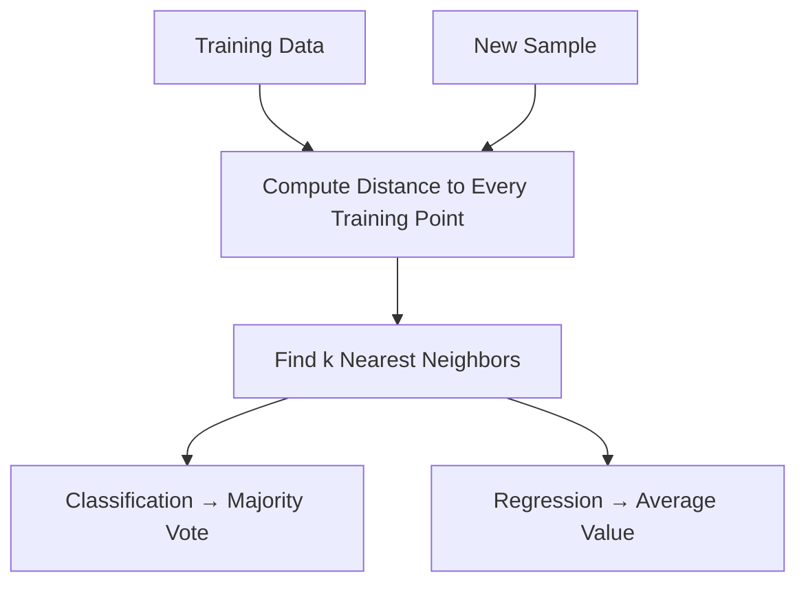
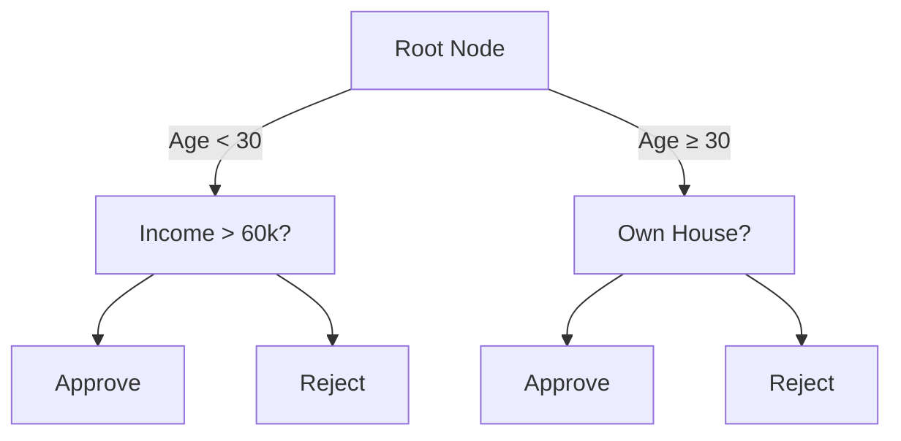
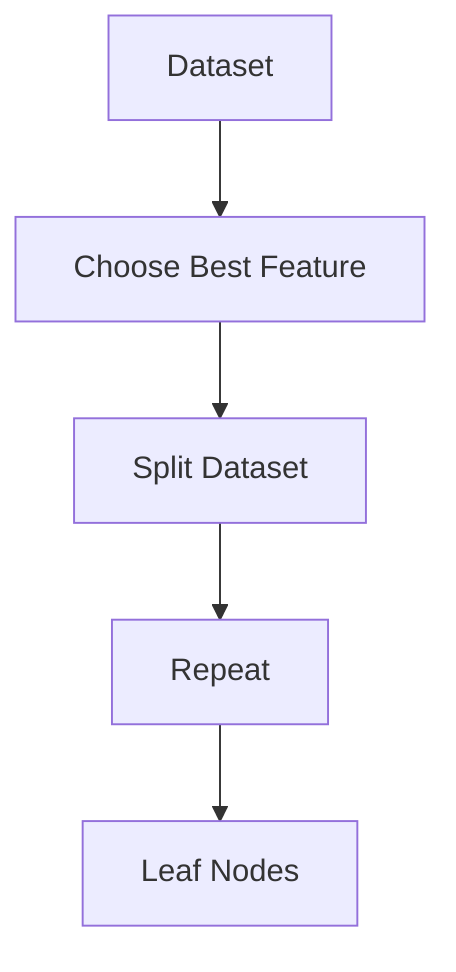
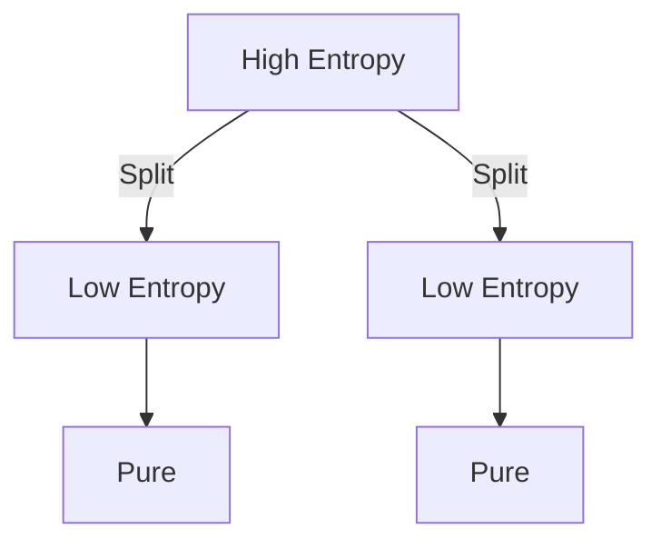
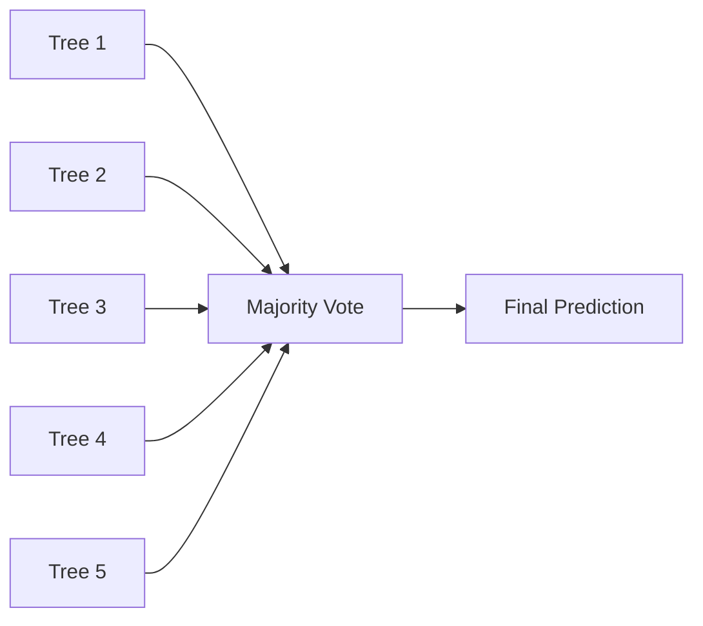
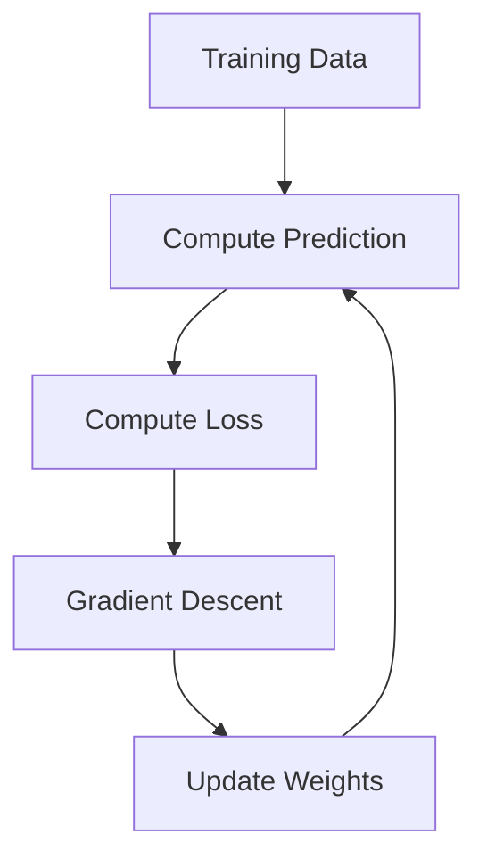

## Part 1 — Introduction to Supervised Learning

# Deep Learning Overview

> [!info]
> Deep learning is a subset of **machine learning** that uses **deep neural networks** to automatically learn patterns from data.
>
> This lecture begins by introducing **supervised learning**, which forms the foundation of many deep learning applications.

# What is Machine Learning?

> [!important]
> **Machine Learning** is an algorithm that learns a function by observing **input-output examples**.

Instead of writing explicit rules,

```
    Input
      ↓
Learning Algorithm
      ↓
Learned Function
      ↓
    Output
```

the algorithm automatically discovers the relationship between inputs and outputs.

## Mathematical View

The goal is to learn a function $f(x) = y$ where

- **x** = input
- **y** = desired output

Instead of programming the function manually, we estimate it from data.

---
# Why Do We Need Machine Learning?

Some problems are simply too complicated to solve with manually written rules.

Examples include:

- Image recognition
- Speech recognition
- Language translation
- Recommendation systems

These problems contain enormous variation that cannot realistically be captured using handcrafted logic.

> [!note]
> The lecture refers to these as **complex tasks**:
>
> Tasks that **cannot be solved reliably using business rules or hard-coded logic**.

---

# Hard-Coded Rules vs Machine Learning

| Hard-Coded Programming | Machine Learning |
|------------------------|------------------|
| Human writes rules | Algorithm learns rules |
| Works well for simple logic | Works well for complex patterns |
| Difficult to maintain | Improves with more data |
| Poor scalability | Good scalability |


## Traditional Programming

```text
Rules
        +
Input
        ↓
Output
```

Example

```
IF temperature > 100°C
THEN alarm = ON
```

## Machine Learning

```text
Input + Correct Answers
            ↓
     Learning Algorithm
            ↓
      Learned Model
            ↓
 Predict New Outputs
```

Instead of writing rules ourselves, we provide examples.

---
# What Does the Model Learn?

The lecture emphasizes that the model learns

- patterns
- structures
- relationships

inside the input data.

These hidden structures allow the model to make predictions on new data.

```text
Training Data

Image → Eagle
Image → Eagle
Image → Eagle

↓

Model discovers

• Shapes
• Edges
• Colors
• Texture
• Spatial relationships

↓

Can recognize
new eagle images
```

---
# Supervised Learning

> [!important]
> In **supervised learning**, every training example contains:
>
> - an input
> - the correct output (label)

Example

| Input | Label |
|--------|-------|
| Eagle image | Eagle |
| Cat image | Cat |
| Car image | Car |

The algorithm learns the mapping $Input \rightarrow Label$

## Why is it called "Supervised"?

Because the algorithm is given the correct answer during training.

The labels act as the "teacher."

# Applications Mentioned in the Lecture

The lecture discusses several important applications.

| Application | Goal |
|-------------|------|
| Speech Recognition | Convert speech into text |
| Computer Vision | Recognize objects in images |
| Recommendation Systems | Suggest relevant content |
| Fraud Detection | Detect suspicious transactions |
| Credit Scoring | Estimate financial risk |
| Search Engines | Improve search quality |
| Advertising | Show relevant ads |
| Self-Driving Cars | Understand the environment |

> [!example]
> Facebook (Meta) uses machine learning for:
>
> - Feed recommendations
> - Reels recommendations
> - Instagram recommendations
> - Search
> - Advertisement ranking
> - Assistant features

---
# Why Recommendation Systems Need ML

Imagine recommending videos manually.

Rules like

```
IF age = 25
AND likes sports
THEN recommend football
```

quickly become impossible because user interests constantly change.

Instead,

```
User Behavior
        ↓
Machine Learning
        ↓
Personalized Recommendations
```

---

# Example: Recognizing an Eagle

The lecture introduces object detection using multiple eagle images.

Although every image contains an eagle,

each image is different.

Differences include:

- Pose
- Size
- Lighting
- Background
- Orientation
- Distance
- Camera angle

## Why Hard Coding Fails

Suppose we try to write rules.

```
IF
Brown wings
AND Yellow beak
AND White head

THEN Eagle
```

Problems:

- Eagle may face sideways.
- Wings may be folded.
- Lighting changes color.
- Background changes.
- Some eagles are partially hidden.

The number of required rules becomes enormous.

> [!warning]
> Hard-coded rules usually fail because real-world objects appear in many different forms.

---

# Machine Learning Solution

Instead of writing rules,

we provide many labeled examples.

```
Image
      ↓
Label = Eagle

Image
      ↓
Label = Eagle

Image
      ↓
Label = Eagle

↓

Model learns
common patterns
```

## Object Detection

The lecture introduces **bounding boxes**.

Instead of only predicting

```
Eagle
```

the model predicts

```
Image

┌─────────────┐
│                           │
│        Eagle          │
│                            │
└─────────────┘

Class = Eagle
```

The box tells the model **where** the object is located.

---

# Generalization

Perhaps the most important concept introduced in this lecture.

> [!important]
> Machine learning is **not** about memorizing training data.
>
> It is about learning patterns that work on **new, unseen data**.


## Generalization Process

```text
Training Images
        ↓
Pattern Learning
        ↓
General Model
        ↓
New Image
        ↓
Correct Prediction
```

---

# Inference

The lecture introduces the term **Inference**.

> [!info]
> **Inference** is the process of using a trained model to make predictions on previously unseen data.

Training and inference are different phases.

| Training | Inference |
|-----------|-----------|
| Learn model | Use model |
| Uses labels | No labels |
| Adjusts parameters | Parameters fixed |

---

# Why Patterns Matter

The lecture emphasizes that

the raw pixels themselves are less important than the **patterns** inside those pixels.

For example,

the model may learn

- feather texture
- wing shapes
- beak geometry
- body proportions

rather than memorizing specific images.

---

# ImageNet Example

The lecture briefly introduces **ImageNet**.

> [!info]
> ImageNet is a very large labeled image dataset widely used for image classification research.

The lecture mentions:

- over 100,000 images
- many object categories
- large variation in appearance


## Why ImageNet is Important

Large datasets expose the model to many variations.

```
Many Examples
        ↓
Better Pattern Learning
        ↓
Better Generalization
```

---

# Deep Learning Performance

According to the lecture, deep learning can achieve approximately

- **95% classification accuracy**
- **< 5% error**

on the ImageNet example discussed.

---

> [!note]
> The key takeaway is **not the exact number**, but that deep learning dramatically outperforms manually written rules for complex visual recognition tasks.

---

# Connections to Earlier AI Topics

> [!tip]
> This lecture naturally connects with previous AI topics.

| Previous Topic | Connection |
|---------------|------------|
| Decision Trees | Also supervised learning |
| Naive Bayes | Learns probabilistic mappings |
| Logistic Regression | Learns decision boundaries |
| Random Forest | Ensemble supervised learning |
| Neural Networks | Deep learning extends these with many hidden layers |

Unlike Decision Trees or Logistic Regression, deep learning automatically learns useful features from raw data.

---

# Summary

> [!summary]
> - Machine learning learns functions from labeled examples.
> - Supervised learning requires input-output pairs.
> - Complex tasks cannot be solved with hard-coded rules.
> - Machine learning discovers hidden patterns in data.
> - Generalization is the ultimate goal.
> - Inference means making predictions on unseen data.
> - Object detection combines classification with localization using bounding boxes.
> - Deep learning performs extremely well on large image datasets such as ImageNet.

---

# Exam Focus

> [!important]
> Know the following definitions:
>
> - Machine Learning
> - Supervised Learning
> - Generalization
> - Inference
> - Object Detection
> - Bounding Box
> - Why hard-coded rules fail
> - Why large labeled datasets improve learning

# General Concepts

Machine Learning is a method of learning a function directly from data instead of explicitly programming rules.

Instead of writing instructions manually:

```
Input
   ↓
Thousands of if-else rules
   ↓
Output
```

Machine learning learns the mapping automatically:

```
Training Data

(Input, Output)

      ↓

Learning Algorithm

      ↓

Learned Function f(x)

      ↓

Prediction
```

---

# What is Machine Learning?

> Machine Learning learns a function by observing examples of inputs and outputs.

Instead of manually designing rules:

```
IF wings
AND feathers
AND yellow beak
THEN eagle
```

we provide examples.

```
Image → Eagle

Image → Eagle

Image → Eagle

Image → Not Eagle
```

The algorithm discovers the patterns itself.

## Formal Definition

Given

```
Input x

↓

Unknown Function

↓

Output y
```

Machine learning approximates $f(x) \approx y$

The learned function should generalize beyond the training data.

---

# Why Do We Need Machine Learning?

Many problems cannot realistically be solved using hand-written rules.

Examples include:

- speech recognition
    
- computer vision
    
- fraud detection
    
- recommendation systems
    
- autonomous driving
    
- search ranking
    
- language translation
    

These problems contain enormous variability.

## Example — Eagle Detection

The lecture uses eagle recognition.

Although every image contains an eagle,

the eagle differs in

- pose
    
- orientation
    
- lighting
    
- size
    
- background
    
- distance
    
- scale
    

```
Image A

      Eagle

Image B

      Eagle

Image C

      Eagle
```

Writing rules for every possible appearance is impossible.

Instead,

```
Images

+

Labels

↓

Machine Learning

↓

Classifier
```

---

# Object Detection

Unlike simple classification,

object detection also predicts **where** the object is.

Training data contains

```
Image

+

Bounding Box

+

Label
```

Example

```
----------------------

        Eagle

      ┌────────┐
      │ Eagle      │
      └────────┘

----------------------
```

The model learns

- object identity
    
- object location
    

---

# Generalization

This is one of the central ideas in machine learning.

The model never memorizes individual images.

Instead,

it learns

- shapes
    
- textures
    
- patterns
    
- edges
    
- statistical relationships
    

so that it performs well on

> unseen data.

## Training vs Inference

Training

```
Known Inputs

Known Labels

↓

Learn Parameters
```

Inference

```
New Image

↓

Learned Model

↓

Prediction
```

The lecture emphasizes that success depends on performing well during **inference**, not merely fitting the training data.

---

# ImageNet Example

The lecture mentions the ImageNet dataset.

ImageNet contains:

- over 100,000 images (historically, the full dataset contains millions)
    
- many object categories
    
- large variability in appearance
    

Deep neural networks achieve approximately

```
≈95%

classification accuracy

≈5%

error
```

This performance is possible because deep learning discovers complex visual features automatically.

---

# Types of Machine Learning

```
Machine Learning

├── Supervised Learning
│
├── Unsupervised Learning
│
├── Weakly / Semi-supervised Learning
│
└── Reinforcement Learning
```

Only the first three are introduced here.

---

# Supervised Learning

Training data contains

```
Input

+

Correct Output
```

Example

|Image|Label|
|---|---|
|Eagle|Eagle|
|Dog|Dog|
|Cat|Cat|

The goal is to learn $x \rightarrow y$

## Applications

- image classification
    
- spam detection
    
- price prediction
    
- disease diagnosis
    
- speech recognition
    

---

# Unsupervised Learning

Training data contains only inputs.

```
Input

NO Labels
```

Goal:

Discover hidden structure.

Possible tasks:

- clustering
    
- dimensionality reduction
    
- anomaly detection
    

Instead of predicting labels,

the algorithm asks

> "How is this data naturally organized?"

---

# Weakly (Semi-) Supervised Learning

The lecture refers to this as **weakly supervised learning**.

Training data contains

```
Few Labels

+

Many Unlabeled Examples
```

Example

```
100 labeled images

9000 unlabeled images
```

Algorithms propagate information from labeled examples to unlabeled examples.

Techniques include

- label propagation
    
- pseudo-labeling
    
- consistency learning
    

---

# Training Dataset Structure

Typical supervised dataset

|Features|Target|
|---|---|
|x₁||
|x₂||
|x₃|→ y|
|...||


## Features

Features may include

Numeric

```
Age

Salary

Height
```

Categorical

```
Red

Blue

Green
```

Text

```
"This movie is great."
```

Images

Speech

Sensor values

---

# Feature Encoding

Machine learning operates on numbers.

Text

```
Cat
```

cannot be processed directly.

Instead,

it becomes a numerical representation.

Example

One-hot encoding

```
Dog

↓

[1 0 0]

Cat

↓

[0 1 0]

Bird

↓

[0 0 1]
```

Later deep learning replaces one-hot vectors with learned embeddings.

---

# Typical Supervised Learning Pipeline

```
Dataset

↓

Training Set

↓

Learning Algorithm

↓

Model

↓

Validation/Test Set

↓

Error Rate
```

The validation/test set estimates generalization performance.

# Two Main Supervised Learning Tasks

```
Supervised Learning

├── Regression
│
└── Classification
```

---

# Regression

Output is continuous.

```
Input

↓

Real Number
```

Examples

- temperature prediction
    
- house prices
    
- stock values
    
- rainfall prediction
    

Example

```
House Size

↓

Price

$540,000
```


## Mathematical View

Regression learns $f(x) \in \mathbb{R}$. The output belongs to the real numbers.

# Classification

Output belongs to a finite set of categories.

Example

```
Weather

↓

Sunny

Cloudy

Rainy
```

or

```
Flower

↓

Setosa

Versicolor

Virginica
```


## Mathematical View

Classification learns $f(x)\in{C_1,C_2,\ldots,C_k}$

# Iris Dataset Example

The lecture introduces the classic Iris dataset.

Input features

- sepal length
    
- sepal width
    
- petal length
    
- petal width
    

Output

```
Setosa

Versicolor

Virginica
```

This is one of the most widely used datasets in machine learning.

---

# Clustering

Unlike classification,

clusters are discovered automatically.

Initially

```
Unknown Data
```

↓

Algorithm

↓

```
Cluster A

Cluster B

Cluster C
```

No labels are provided.

## Goal of Clustering

Find natural groupings based on similarity.

Similarity is often measured using

- Euclidean distance
    
- cosine similarity
    
- probability distributions
    

---

# Dimensionality Reduction

Although only briefly mentioned,

the lecture introduces dimensionality reduction.

High-dimensional data

```
100 features
```

↓

Lower-dimensional representation

```
2 dimensions
```

Benefits

- visualization
    
- noise reduction
    
- compression
    
- preprocessing
    

Examples

- PCA _(covered in CS7641)_
    
- t-SNE
    
- UMAP
    

---

# Key Distinction

|Supervised|Unsupervised|
|---|---|
|Labels available|No labels|
|Predict outputs|Discover structure|
|Classification|Clustering|
|Regression|Dimensionality Reduction|


# Connections to Previous AI Lectures

## Decision Trees

Decision Trees solve

```
Supervised Classification
```

They learn

```
Features

↓

Decision Rules

↓

Prediction
```

rather than learning continuous feature representations.


## Bayesian Learning

Bayesian classifiers are also supervised learners.

Instead of learning

```
Deep Features
```

they estimate $P(Y|X)$ using probability.

## HMMs

Hidden Markov Models are supervised sequence models.

Instead of

```
Single Input

↓

Single Output
```

they learn

```
Sequence

↓

Sequence Prediction
```

using temporal dependencies.

## Deep Learning

Deep learning is **not a different learning paradigm**.

It is a **family of machine learning models**.

```
Machine Learning

↓

Supervised Learning

↓

Deep Neural Networks
```

Deep learning mainly differs by automatically learning hierarchical feature representations instead of relying on manually engineered features.

---

# Important Takeaways

> Machine learning learns functions from data rather than explicit rules.

> The goal is **generalization**, not memorization.

> Supervised learning requires labeled data.

> Unsupervised learning discovers hidden structure without labels.

> Regression predicts continuous values.

> Classification predicts discrete categories.

> Deep learning is a powerful approach for supervised learning because it automatically learns useful feature representations from raw data.

# k-Nearest Neighbors (k-NN)

> [!info]
> **k-Nearest Neighbors (k-NN)** is one of the simplest supervised learning algorithms.
>
> It can be used for:
> - Classification
> - Regression
>
> Unlike most ML algorithms, **k-NN performs almost no training**. Instead, it stores the training data and performs computation only during prediction.

Refer: [[2 - k-Nearest Neighbors]]

---

# Core Idea

For a new sample:

1. Compute its distance to every training example.
2. Find the **k closest neighbors**.
3. Predict based on those neighbors.

## Classification

Uses **majority voting**.

Example:

```
Neighbors (k = 5)

🔴
🔴
🔴
🔵
🔵
```

Red = 3

Blue = 2

Prediction:

```
New Point → 🔴
```

The class with the most votes wins.

## Regression

Instead of majority voting,

take the average of the neighbor values.

Example

Neighbor prices

```
$400k
$420k
$410k
```

Prediction

$$
\hat y
=
\frac{400+420+410}{3}
=
410
$$

---

# k-NN Algorithm



---

# Distance Functions

The most important part of k-NN is deciding **what "nearest" means.**

Distance is computed using a distance metric.

## L1 Distance (Manhattan Distance)

Measures the sum of absolute coordinate differences.

$$
d(x,y)
=
\sum_{i=1}^{n}
|x_i-y_i|
$$

Example

$$
(2,5)
\rightarrow
(4,8)
$$

Distance

$$
|2-4|+|5-8|
=
2+3
=
5
$$

### Geometry

L1 produces **diamond-shaped neighborhoods**.

```
      ◇
    ◇ ● ◇
      ◇
```


## L2 Distance (Euclidean Distance)

The standard straight-line distance.

$$
d(x,y)
=
\sqrt{
\sum_{i=1}^{n}
(x_i-y_i)^2
}
$$

Example

$$
(2,5)
\rightarrow
(4,8)
$$

Distance

$$
\sqrt{(2)^2+(3)^2}
=
\sqrt{13}
$$

### Geometry

Produces circular neighborhoods.

```
     ○○○
   ○            ○
  ○       ●      ○
   ○               ○
     ○○○
```


## Comparison

| L1 Distance | L2 Distance |
|-------------|-------------|
| Manhattan distance | Euclidean distance |
| Absolute differences | Squared differences |
| Diamond neighborhoods | Circular neighborhoods |
| More robust to outliers | More sensitive to outliers |

---

> [!important]
> The lecture mentions:
>
> - **L2 distance** generally works well when data forms **compact or spherical clusters.**
> - **L1 distance** may work better when data distributions are irregular or elongated.

---

# Choosing k

Small k

```
k = 1
```

- Very sensitive to noise
- High variance
- Can overfit

Large k

```
k = 50
```

- Very smooth decision boundary
- High bias
- Can underfit

---

> [!tip]
> Choose **k** using cross-validation.

---

# Weighted k-NN

Not all neighbors should contribute equally.

Closer neighbors are usually more informative.

Instead of equal voting,

assign weights based on distance.

Common weighting

$$
w_i
=
\frac{1}{d_i}
$$

or

$$
w_i
=
\frac{1}{d_i^2}
$$

Prediction becomes

Classification

Weighted vote

Regression

Weighted average

$$
\hat y
=
\frac{
\sum_i
w_i y_i
}
{
\sum_i
w_i
}
$$

---

# Handling Imbalanced Data

Real datasets often contain unequal class frequencies.

Example

```
Healthy Patients : 950

Cancer Patients : 50
```

A standard majority vote tends to predict the majority class.

## Solution

Use **weighted voting**.

Assign higher importance to minority-class examples.

Instead of

```
1 vote each
```

Use

```
Majority class
Weight = 1

Minority class
Weight = 5
```

This prevents the majority class from dominating predictions.

---

> [!warning]
> Without balancing,
>
> an overrepresented class can dominate prediction,
> resulting in poor performance on minority classes.

---

# Advantages

✅ Extremely simple

✅ No model training

✅ Works for classification and regression

✅ Naturally handles multi-class problems

---

# Disadvantages

❌ Prediction is slow

Must compare with every training example.

---

❌ Sensitive to irrelevant features

Feature scaling becomes important.

---

❌ Suffers from the Curse of Dimensionality

As dimensions increase,

all points become similarly distant,

making nearest neighbors less meaningful.

---

❌ Sensitive to noisy data

Especially when

```
k = 1
```

---

# Complexity

Training

$$
O(1)
$$

(just stores the data)

Prediction

$$
O(n)
$$

Must compare against every training sample.

---

# Lecture Connections

## Supervised Learning

k-NN is a **supervised learning** algorithm because it requires labeled examples.

## Classification

Uses majority voting among neighbors.

## Regression

Uses average (or weighted average) of neighbor values.

## Feature Representation

Before using k-NN,

categorical features are usually converted into vectors.

Examples

- One-hot encoding
- Embeddings
- Numeric normalization

# Exam Note

> [!summary]
> Remember:
>
> - k-NN is **instance-based learning**.
> - No explicit training.
> - Classification → Majority vote.
> - Regression → Average.
> - Distance metrics:
>   - L1 = Manhattan
>   - L2 = Euclidean
> - Small k → Overfitting.
> - Large k → Underfitting.
> - Weighted voting helps with **imbalanced datasets**.
> - Training cost is negligible.
> - Prediction cost is expensive.

# Decision Trees & Random Forests

> [!info]
> **Decision Trees** are supervised learning algorithms that recursively split the feature space into smaller regions until a prediction can be made.
>
> They are widely used because they are **interpretable**, **fast**, and work for both **classification** and **regression** problems.

---

# Core Idea

A decision tree asks a sequence of questions about the input features.

Each question splits the data into smaller subsets.

Eventually, a **leaf node** contains the prediction.



Each internal node represents

- a feature
- a threshold
- a decision

Each leaf represents

- predicted class
- predicted value

---

# Decision Boundary

Unlike linear models,

Decision Trees partition the feature space into regions.

```
Feature Space

───────────────
│            │
│      A    │  B
│──────┼──────
│       C   │  D
│            │
───────────────
```

Each region predicts a single output.

---

# Why Use Decision Trees Instead of Deep Learning?

Deep Neural Networks often achieve higher accuracy.

However,

they are difficult to interpret.

Decision Trees provide explicit reasoning.

Example

```
Age > 40?

YES

Income > 60k?

YES

Loan Approved
```

Every prediction can be explained.

---

> [!important]
> Decision Trees are preferred when **model explainability** is as important as predictive accuracy.

Examples

- Banking
- Credit scoring
- Insurance
- Medical diagnosis
- Government decision systems

---

# Explainability

Deep Learning

```
Input

↓

Millions of Parameters

↓

Prediction
```

Hard to explain.

---

Decision Tree

```
Input

↓

Question 1

↓

Question 2

↓

Prediction
```

Easy to explain.

This is one reason financial institutions often prefer decision trees.

---

# Growing the Tree

A tree is built recursively.

At each node

1. Choose the best feature.
2. Choose the best split point.
3. Divide the data.
4. Repeat on each subset.



---

# Split Criterion

The key question is

> Which feature should we split on?

Decision Trees choose the split that produces the **purest** child nodes.

Common criteria

- Information Gain
- Gini Index
- Variance Reduction (Regression)

The lecture focuses on **Information Gain**.

---

# Entropy

Entropy measures impurity or uncertainty.

$$
H(S)
=
-\sum_{i=1}^{k}
p_i
\log_2
p_i
$$

where

- $p_i$ = probability of class $i$

## Interpretation

Low entropy

```
100% Cats
```

Very pure.

Entropy = 0

---

High entropy

```
50% Cats

50% Dogs
```

Maximum uncertainty.

Higher entropy.

---

# Information Gain

Information Gain measures how much uncertainty decreases after a split.

$$
IG
=
H(parent)
-
\sum_i
\frac{|S_i|}{|S|}
H(S_i)
$$

The best split is the one with the **highest Information Gain**.

---



Goal

Reduce entropy as much as possible.

---

# Tree Depth

The tree continues splitting until a stopping criterion is reached.

Without stopping,

the tree can become extremely large.

```
Root

↓

Split

↓

Split

↓

Split

↓

Split

↓

Split
```

Eventually,

every training sample becomes its own leaf.

---

# Overfitting

Very deep trees memorize the training data.

Characteristics

✅ Very high training accuracy

❌ Poor generalization

❌ High variance

---

# Stopping Criteria

To prevent overfitting,

we stop growing the tree.

Common stopping conditions

- Maximum tree depth
- Minimum samples per node
- Minimum Information Gain
- Minimum impurity decrease
- Maximum number of leaves

---

> [!warning]
> Choosing the stopping criterion is a form of **regularization**.

Stopping too early

→ Underfitting

Stopping too late

→ Overfitting

---

# Random Forest

A **Random Forest** is an ensemble of Decision Trees.

Instead of relying on one tree,

it trains many trees and combines their predictions.



## Why Random Forest Works

Each tree makes slightly different errors.

Combining many trees

↓

reduces variance

↓

improves generalization

↓

reduces overfitting.

---

# Decision Trees vs Random Forest

| Decision Tree | Random Forest |
|---------------|---------------|
| Single tree | Many trees |
| Easy to interpret | Harder to interpret |
| Higher variance | Lower variance |
| Can overfit | Much less overfitting |
| Faster | Slower |
| Explainable | Less explainable |

---

# Advantages

✅ Easy to interpret

✅ No feature scaling required

✅ Handles categorical and numerical data

✅ Fast prediction

✅ Naturally models nonlinear relationships

---

# Disadvantages

❌ Can overfit

❌ High variance

❌ Small changes in data may produce a different tree

# Connections

## [[Classification]]

Predicts discrete labels.

## [[Regression]]

Predicts continuous values.

## [[Entropy]]

Measures uncertainty.

## [[Information Gain]]

Determines the best split.

## [[Bias-Variance Tradeoff]]

Growing deeper trees

↓

Lower bias

Higher variance

Stopping earlier

↓

Higher bias

Lower variance


## [[Ensemble Learning]]

Random Forest is an ensemble method that reduces variance by averaging many decision trees.


# Exam Note

> [!summary]
>
> - Decision Trees recursively split the feature space.
> - The goal is to maximize **Information Gain** (or minimize impurity).
> - Entropy measures uncertainty:
>
> $$
> H(S)
> =
> -\sum_i p_i\log_2 p_i
> $$
>
> - Information Gain:
>
> $$
> IG
> =
> H(parent)
> -
> \sum_i
> \frac{|S_i|}{|S|}
> H(S_i)
> $$
>
> - Deep trees tend to overfit.
> - Stopping criteria act as regularization.
> - Random Forest reduces variance by combining many decision trees.
> - Decision Trees are highly explainable, making them useful in domains like finance and healthcare.

# Gradient Descent

> [!abstract]
> **Gradient Descent** is the most widely used optimization algorithm in machine learning, especially in **deep learning**. Instead of solving for the optimal parameters directly, it **iteratively updates model parameters to minimize a loss function**.

---

## Why Gradient Descent?

Many machine learning models **cannot be solved analytically** (closed-form solution).

Instead, we repeatedly improve the model by moving the parameters in the direction that **reduces prediction error**.

> **Goal:** Find parameters that minimize the loss function.

---

# Intuition

Imagine standing on top of a mountain covered in fog.

You cannot see the entire landscape.

The only information available is:

- Which direction is uphill
- Which direction is downhill

You simply keep taking small steps downhill until you reach a valley.

Machine learning does exactly the same thing.

- Mountain → Loss surface
- Height → Error (Loss)
- Valley → Best parameters
- Walking downhill → Gradient Descent

---

# Optimization Process

The algorithm repeatedly performs four steps.

## Step 1 — Compute Predictions

Use the current model parameters.

$$
\hat{y}=f(x;\theta)
$$

where

- $x$ = input
- $\theta$ = model parameters
- $\hat y$ = prediction

---

## Step 2 — Compute Loss

Measure how wrong the predictions are.

Examples:

- Mean Squared Error (Regression)
- Cross Entropy Loss (Classification)

General form:

$$
L(\theta)
$$

The loss is a function of the model parameters.

Higher loss

→ Poor predictions

Lower loss

→ Better predictions

---

## Step 3 — Compute Gradient

Find the slope of the loss function.

$$
\nabla_\theta L(\theta)
$$

The gradient tells us

- which direction increases loss
- how steep the increase is

---

## Step 4 — Update Parameters

Move in the opposite direction of the gradient.

Gradient Descent update rule:

$$
\theta_{new}
=
\theta_{old}
-
\eta
\nabla_\theta L(\theta)
$$

where

- $\eta$ = learning rate
- $\nabla_\theta L$ = gradient

Since the gradient points uphill,

subtracting it moves downhill.

---

# Complete Algorithm

```text
Initialize parameters randomly

Repeat:

    Compute predictions

    Compute loss

    Compute gradients

    Update parameters

Until:

    Loss converges
    OR
    Maximum epochs reached
```

---

# Learning Rate

The **learning rate** determines how large each step should be.

Learning rate:

$$
\eta
$$

---

## Small Learning Rate

```text
      O
     /
    /
   /
```

Pros

- Stable
- Accurate

Cons

- Slow training

---

## Large Learning Rate

```text
O     O      O
 \   /
  \ /
```

Pros

- Faster

Cons

- May overshoot the minimum
- Can diverge

---

## Good Learning Rate

```text
Start

↓

↓

↓

Minimum
```

Balances

- speed
- stability

---

# Convergence

Training stops when one of the following occurs:

- Loss stops decreasing
- Gradient becomes very small

$$
\nabla_\theta L \approx 0
$$

- Desired accuracy is reached
- Maximum number of iterations (epochs) is reached

---

# Why Not Solve Directly?

A natural question is:

> Why don't we simply solve the equations exactly?

For many modern ML models,

there is **no closed-form solution**.

Reasons include

- Millions or billions of parameters
- Highly non-linear models
- Complex activation functions
- Massive datasets

Instead,

Gradient Descent provides a practical iterative solution.

---

# Local vs Global Minimum

Machine learning loss functions are usually **non-convex**.

Gradient Descent does **not guarantee** the absolute best solution.

Instead, it usually finds a **local minimum**.

```text
Loss

^

|        __
|   __  /  \__
|__/  \/       \____

        ^
   Local Minimum

Global minimum may exist elsewhere.
```

Deep learning models still work well because many local minima produce excellent performance.

---

# Why GPUs Matter

Deep learning requires millions of gradient computations.

Each training iteration performs

- Forward propagation
- Loss computation
- Backpropagation
- Weight updates

Modern neural networks may require

- billions of floating-point operations
- thousands of training iterations

Therefore, training commonly uses

- GPUs
- TPUs
- Distributed computing

---

# Connection to Deep Learning

Gradient Descent is the optimization engine behind nearly every deep learning model.

Examples include

- Feedforward Neural Networks
- Convolutional Neural Networks (CNNs)
- Recurrent Neural Networks (RNNs)
- Transformers

Without Gradient Descent, these models cannot effectively learn their parameters.

---

# Advantages

✅ Works for extremely complex models

✅ Scales to millions of parameters

✅ Simple to implement

✅ Supports deep neural networks

---

# Limitations

❌ May converge slowly

❌ Sensitive to learning rate

❌ Can get trapped in local minima or saddle points

❌ Computationally expensive for very large models

---

> [!tip] Exam Takeaway
>
> **Gradient Descent** is an **iterative optimization algorithm** that minimizes a **loss function** by repeatedly updating model parameters in the direction opposite to the gradient.
>
> Update rule:
>
> $$
> \theta_{new}
> =
> \theta_{old}
> -
> \eta
> \nabla_\theta L(\theta)
> $$
>
> It is the foundation of training modern deep learning models.

# Logistic Regression

> [!abstract]
> **Logistic Regression** is a **supervised learning algorithm** used primarily for **binary classification**.
>
> Despite its name, it is **not a regression algorithm**. Instead, it predicts the **probability that an input belongs to a particular class**.

---

# Core Idea

Unlike Linear Regression, which predicts any real value,

Logistic Regression predicts a **probability** between **0 and 1**.

```
Input Features

↓

Linear Combination

↓

Sigmoid Function

↓

Probability

↓

Threshold

↓

Predicted Class
```

---

# Why is it Called "Regression"?

The model first computes a **continuous score**

$$
z=\theta^T x
$$

where

- $x$ = input feature vector
- $\theta$ = learned weights

This score is then passed through the **Sigmoid (Logistic) Function** to produce a probability.

---

# Sigmoid (Logistic) Function

The logistic function maps any real number to the interval $[0,1]$.

$$
\sigma(z)
=
\frac{1}{1+e^{-z}}
$$

Since

$$
z=\theta^Tx
$$

the prediction becomes

$$
P(y=1|x)
=
\frac{1}{1+e^{-\theta^Tx}}
$$

---

## Properties

- Output always lies between **0 and 1**
- Can be interpreted as a probability
- Smooth and differentiable
- Suitable for Gradient Descent optimization

---

# Sigmoid Curve

Probability

1.0 |                                         ●●●●
    |                              ●●●
0.8 |                            ●●
    |                     ●●
0.5 |-----------●-------------------
    |             ●
0.2 |          ●
    |   ●
0.0 |●_______________________________

    Negative                 Positive
---

# From Probability to Classification

The model outputs a probability.

Example

$$
P(y=1|x)=0.87
$$

This means

> There is an **87% probability** that the sample belongs to Class 1.

To obtain a class prediction,

choose a threshold.

Most commonly

$$
0.5
$$


Decision rule

$$
\hat y=
\begin{cases}
1 & \text{if } P(y=1|x)\ge0.5\\
0 & \text{otherwise}
\end{cases}
$$

---

# Training the Model

Training consists of learning the weight vector

$$
\theta
$$

that minimizes the prediction error.

Steps

1. Compute predictions
2. Compute loss
3. Compute gradients
4. Update weights
5. Repeat until convergence

---



---

# Loss Function

Logistic Regression does **not** use Mean Squared Error.

Instead it minimizes **Binary Cross-Entropy (Log Loss).**

$$
J(\theta)
=
-\frac1m
\sum_{i=1}^{m}
\left[
y^{(i)}
\log(h_\theta(x^{(i)}))
+
(1-y^{(i)})
\log(1-h_\theta(x^{(i)}))
\right]
$$

where

- $m$ = number of training examples
- $h_\theta(x)$ = predicted probability

---

# Optimization

The loss function is minimized using **Gradient Descent**.

Weight update rule

$$
\theta
\leftarrow
\theta
-
\eta
\nabla_\theta J(\theta)
$$

where

- $\eta$ = learning rate
- $\nabla_\theta J$ = gradient of the loss

---

# Regularization

Regularization helps prevent **overfitting**.

Two common methods are used.

## L1 Regularization (Lasso)

Penalty

$$
\lambda
\sum_i
|\theta_i|
$$

Characteristics

- Performs **feature selection**
- Drives some weights exactly to zero
- More robust to noisy features
- Produces sparse models

## L2 Regularization (Ridge)

Penalty

$$
\lambda
\sum_i
\theta_i^2
$$

Characteristics

- Shrinks weights
- Faster optimization
- Usually smoother models
- Does not eliminate features

---

# L1 vs L2

| L1 Regularization | L2 Regularization |
|-------------------|-------------------|
| Sparse solution | Dense solution |
| Feature selection | Weight shrinkage |
| Robust to noise | Faster convergence |
| Some weights become zero | All weights remain non-zero |

---

# Decision Boundary

Logistic Regression learns a **linear decision boundary**.

```text
Class 0

● ● ● ●

────────────── Decision Boundary

▲ ▲ ▲ ▲

Class 1
```

The boundary occurs when

$$
P(y=1)=0.5
$$

---

# Class Imbalance

The lecture emphasizes that **0.5 is not always the best threshold**.

Instead,

the threshold can be adjusted depending on the application.

## Increase Threshold

Example

$$
P(y=1)>0.8
$$

Predict Class 1 only when the model is very confident.

Result

- Fewer False Positives
- More False Negatives


## Lower Threshold

Example

$$
P(y=1)>0.3
$$

Predict Class 1 more easily.

Result

- Fewer False Negatives
- More False Positives

---

# Threshold Tradeoff

```text
Lower Threshold

More Positive Predictions

↓

Higher Recall

↓

More False Positives

────────────────────────────

Higher Threshold

↓

Higher Precision

↓

More False Negatives
```

---

> [!important]
> Threshold selection depends on the **cost of different errors**, not only overall accuracy.

Examples

Medical Diagnosis

- Missing disease → Very expensive
- Use a **lower threshold**

Spam Detection

- False alarms are annoying
- Use a **higher threshold**

---

# Advantages

✅ Outputs probabilities

✅ Simple and interpretable

✅ Fast training

✅ Works well on linearly separable data

✅ Easy to regularize

---

# Limitations

❌ Assumes a linear decision boundary

❌ Cannot model complex nonlinear relationships

❌ Sensitive to highly correlated features

❌ Performance decreases when classes are not linearly separable


# Connections

## [[Classification]]

Primary use of Logistic Regression.

## [[Linear Regression]]

Both compute

$$
\theta^Tx
$$

Only Logistic Regression applies the **Sigmoid Function**.

## [[Gradient Descent]]

Used to optimize the logistic loss function.

## [[Regularization]]

L1 and L2 reduce overfitting.

## [[Bias-Variance Tradeoff]]

Regularization increases bias slightly while reducing variance.

# Exam Notes (CS6601)

> [!summary]
>
> - Logistic Regression is a **classification algorithm**, despite its name.
> - Predicts probabilities using the **Sigmoid Function**.
>
> $$
> \sigma(z)=\frac1{1+e^{-z}}
> $$
>
> - Uses
>
> $$
> z=\theta^Tx
> $$
>
> - Decision threshold (usually 0.5) converts probabilities into class labels.
> - Trained using **Gradient Descent** and **Cross-Entropy Loss**.
> - L1 regularization performs feature selection.
> - L2 regularization shrinks weights and usually trains faster.
> - Thresholds can be adjusted to balance **False Positives** and **False Negatives**, especially for imbalanced datasets.

# Bias-Variance Tradeoff

> [!abstract]
> One of the most important concepts in Machine Learning is balancing **Bias** and **Variance**.
>
> Every learning algorithm makes assumptions about the data. These assumptions determine whether the model **underfits**, **generalizes well**, or **overfits**.

---

# Inductive Bias

> [!info]
> **Inductive Bias** refers to the assumptions a learning algorithm makes in order to learn from limited training data.

Different algorithms have different inductive biases.

Examples

- k-Nearest Neighbors (k-NN)
- Linear Regression
- Logistic Regression
- Perceptron
- Support Vector Machines (SVM)
- Decision Trees
- Neural Networks

Each algorithm assumes a particular relationship between inputs and outputs.

These assumptions affect:

- Model flexibility
- Generalization ability
- Bias
- Variance

---

# What is Bias?

> [!note]
> **Bias** is the error caused by making overly simple assumptions about the data.

Characteristics

- Model is too simple
- Cannot capture important patterns
- Underfits the data
- Performs poorly on both training and test data

## High Bias Example

Imagine predicting house prices using only a straight line.

```text
Price

|

|        •

|     •

|   •

| •

|_________________________

        House Size

────────── Linear Model
```

The model misses the true nonlinear relationship.

---

# What is Variance?

> [!note]
> **Variance** measures how sensitive a model is to the training data.

Characteristics

- Model is too complex
- Learns noise instead of patterns
- Overfits training data
- Poor generalization to unseen data

## High Variance Example

```text
Price

|

|      •

|   •     •

| •          •

|      /\__/\/\___

|________________________

      House Size
```

The model follows every small fluctuation, including noise.

---

# Underfitting vs Good Fit vs Overfitting

## Underfitting (High Bias)

```text
Training Data

•      •
   •
      •
          •

──────────────
 Straight Line
```

Characteristics

- Model too simple
- Misses important relationships
- High training error
- High testing error

## Good Fit (Balanced)

```text
Training Data

•      •

   •

      •

          •

──────────────╮
              ╰──────
```

Characteristics

- Captures the main trend
- Ignores random noise
- Generalizes well
- Best predictive performance

---

## Overfitting (High Variance)

```text
Training Data

•      •

   •

      •

          •

~~~~/\__/\/\/\~~~~
```

Characteristics

- Fits every training point
- Learns noise
- Very low training error
- High testing error

---

# Polynomial Example

The lecture explains this using polynomial regression.

## Model 1

Linear Model

$$
y=\theta_0+\theta_1x
$$

Characteristics

- Too simple
- Cannot capture saturation
- High Bias
- Underfitting


## Model 2

Quadratic Model

$$
y=\theta_0+\theta_1x+\theta_2x^2
$$

Characteristics

- Captures nonlinear relationship
- Models saturation
- Good balance
- Best generalization

## Model 3

High-Degree Polynomial

$$
y=
\theta_0+
\theta_1x+
\theta_2x^2+
\theta_3x^3+
\theta_4x^4+\cdots
$$

Characteristics

- Too flexible
- Fits noise
- High Variance
- Overfitting

---

# House Price Example

The lecture uses house size vs house price.

## Linear Model

```text
Price

|

|          •

|       •

|    •

| •

|____________________

      Size

──────────────
```

Misses that price growth eventually slows.

---

## Quadratic Model

```text
Price

|

|          •

|       •

|    •

| •

|____________________

       ╭──────────
───────╯
```

Captures the saturation effect.

---

## High-Degree Polynomial

```text
Price

|

|        •

|     •

|  •

|•

|__/\/\/\____/\___
```

Creates unrealistic oscillations.

Poor for unseen data.

---

# Mathematical View

The prediction function becomes increasingly complex.

Linear

$$
y=\theta_0+\theta_1x
$$

Quadratic

$$
y=\theta_0+\theta_1x+\theta_2x^2
$$

Higher Order

$$
y=
\theta_0+
\theta_1x+
\theta_2x^2+
\theta_3x^3+\cdots
$$

Higher-order models have lower bias but higher variance.

---

# Bias-Variance Tradeoff

Increasing model complexity:

```text
Model Complexity

Low ------------------------------------ High

High Bias

↓

Lower Bias

↓

Higher Variance

↓

Overfitting
```

---

# Relationship

```text
Simple Model

↓

High Bias

↓

Underfitting

──────────────────────────

Moderate Complexity

↓

Low Bias

Low Variance

↓

Good Generalization

──────────────────────────

Complex Model

↓

Low Bias

High Variance

↓

Overfitting
```

---

# Bias vs Variance

| High Bias | High Variance |
|------------|---------------|
| Model too simple | Model too complex |
| Underfits | Overfits |
| Misses patterns | Learns noise |
| High training error | Low training error |
| High testing error | High testing error |
| Low flexibility | High flexibility |

---

# Why Overfitting Happens

Common causes

- Model too complex
- Too many parameters
- Too little training data
- No regularization
- Excessively deep decision trees
- Very high-degree polynomials

---

# How to Reduce High Bias

Increase model capacity

- Add more features
- Use more expressive models
- Increase polynomial degree
- Reduce regularization
- Train longer (if under-trained)

---

# How to Reduce High Variance

Reduce model complexity

- Collect more training data
- Apply Regularization (L1/L2)
- Prune decision trees
- Reduce polynomial degree
- Use ensemble methods
- Early stopping
- Cross-validation

---

# Goal

> [!success]
> The objective is **not** to minimize Bias or Variance individually.
>
> The goal is to find the **best balance** between them.

This produces a model that:

- Learns meaningful patterns
- Ignores noise
- Generalizes well to unseen data

# Connection to Other Algorithms

## [[Decision Trees]]

- Very deep trees → High Variance (Overfitting)
- Pruned trees → Better balance


## [[Linear Regression]]

Usually has relatively high bias.

## [[Polynomial Regression]]

Higher polynomial degree

↓

Lower Bias

↓

Higher Variance


## [[k-Nearest Neighbors]]

- Small $k$ → High Variance
- Large $k$ → High Bias


## [[Regularization]]

Regularization intentionally increases bias slightly to reduce variance.


# Exam Notes (CS6601)

> [!summary]
>
> - Every ML algorithm has an **inductive bias**.
> - High Bias → Underfitting.
> - High Variance → Overfitting.
> - Increasing model complexity reduces bias but increases variance.
> - Linear model:
>
> $$
> y=\theta_0+\theta_1x
> $$
>
> often underfits nonlinear data.
> - Quadratic model:
>
> $$
> y=\theta_0+\theta_1x+\theta_2x^2
> $$
>
> may capture important nonlinear relationships.
> - Very high-degree polynomials often overfit.
> - The objective is to find the optimal **Bias–Variance Tradeoff** for the best generalization performance.